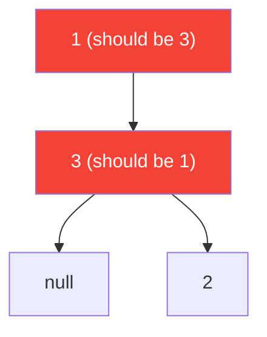

# 99. Recover Binary Search Tree

**Difficulty:** Hard
**Category:** Tree, Depth-First Search, Binary Search Tree, Binary Tree

## Problem

You are given the `root` of a binary search tree (BST), where the values of exactly two nodes were swapped by mistake. Recover the tree without changing its structure (i.e. fix the values in place).

### Example 1

```
Input: root = [1,3,null,null,2]
Output: [3,1,null,null,2]
Explanation: 3 and 1 were swapped.
```



### Example 2

```
Input: root = [3,1,4,null,null,2]
Output: [2,1,4,null,null,3]
Explanation: 2 and 3 were swapped.
```

### Constraints

- The number of nodes in the tree is in the range `[2, 1000]`.
- `-2^31 <= Node.val <= 2^31 - 1`

## Approach

An inorder traversal of a valid BST produces values in strictly ascending order. Walk the tree inorder, tracking the previously visited node; whenever the current node's value is smaller than the previous node's value, a "violation" is found. With exactly two nodes swapped, at most two such violations occur — the first violation's earlier node and the second violation's later node are exactly the two swapped nodes (or, if only one violation occurs, both its nodes are the swapped pair — they're adjacent in the traversal).

## C# Solution

```csharp
public class Solution
{
    private TreeNode first, second, prev;

    public void RecoverTree(TreeNode root)
    {
        first = second = prev = null;
        InorderTraverse(root);

        (first.val, second.val) = (second.val, first.val);
    }

    private void InorderTraverse(TreeNode node)
    {
        if (node == null) return;

        InorderTraverse(node.left);

        if (prev != null && prev.val > node.val)
        {
            if (first == null) first = prev;
            second = node;
        }
        prev = node;

        InorderTraverse(node.right);
    }
}
```

## Complexity

- **Time:** `O(n)` — one inorder traversal.
- **Space:** `O(h)` — recursion depth equal to the tree height.
