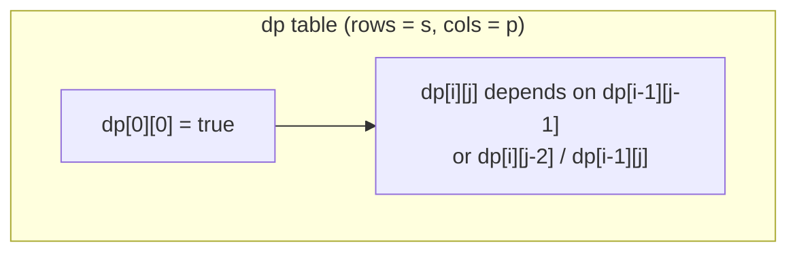

# 10. Regular Expression Matching

**Difficulty:** Hard
**Category:** String, Dynamic Programming, Recursion

## Problem

Given an input string `s` and a pattern `p`, implement regular expression matching with support for `'.'` and `'*'` where:

- `'.'` matches any single character.
- `'*'` matches zero or more of the preceding element.

The matching should cover the **entire** input string (not partial).

### Example 1

```
Input: s = "aa", p = "a"
Output: false
Explanation: "a" does not match the entire string "aa".
```

### Example 2

```
Input: s = "aa", p = "a*"
Output: true
Explanation: '*' means zero or more of the preceding element, 'a'. Therefore, by repeating 'a' once, it becomes "aa".
```

### Example 3

```
Input: s = "ab", p = ".*"
Output: true
Explanation: ".*" means "zero or more (*) of any character (.)".
```



### Constraints

- `1 <= s.length <= 20`
- `1 <= p.length <= 20`
- `s` contains only lowercase English letters.
- `p` contains only lowercase English letters, `'.'`, and `'*'`.
- It is guaranteed for each appearance of the character `'*'`, there will be a previous valid character to match.

## Approach

Build a 2-D DP table where `dp[i][j]` is `true` if `s[0..i)` matches `p[0..j)`. A direct character/`.` match copies the diagonal cell. A `'*'` either erases itself and the preceding pattern character (zero occurrences, `dp[i][j-2]`) or, if the preceding pattern character matches the current text character, also inherits `dp[i-1][j]` (one more occurrence).

## C# Solution

```csharp
public class Solution
{
    public bool IsMatch(string s, string p)
    {
        int m = s.Length, n = p.Length;
        bool[,] dp = new bool[m + 1, n + 1];
        dp[0, 0] = true;

        for (int j = 1; j <= n; j++)
        {
            if (p[j - 1] == '*') dp[0, j] = dp[0, j - 2];
        }

        for (int i = 1; i <= m; i++)
        {
            for (int j = 1; j <= n; j++)
            {
                if (p[j - 1] == '.' || p[j - 1] == s[i - 1])
                {
                    dp[i, j] = dp[i - 1, j - 1];
                }
                else if (p[j - 1] == '*')
                {
                    dp[i, j] = dp[i, j - 2];

                    if (p[j - 2] == '.' || p[j - 2] == s[i - 1])
                    {
                        dp[i, j] = dp[i, j] || dp[i - 1, j];
                    }
                }
            }
        }

        return dp[m, n];
    }
}
```

## Complexity

- **Time:** `O(m * n)` — one pass over the DP table.
- **Space:** `O(m * n)` — for the DP table.
