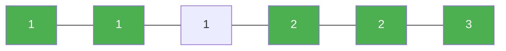

# 80. Remove Duplicates from Sorted Array II

**Difficulty:** Medium
**Category:** Array, Two Pointers

## Problem

Given an integer array `nums` sorted in non-decreasing order, remove some duplicates in-place such that each unique element appears at most **twice**. Return the number of elements after this modification.

### Example 1

```
Input: nums = [1,1,1,2,2,3]
Output: 5, nums = [1,1,2,2,3,_]
```



### Example 2

```
Input: nums = [0,0,1,1,1,1,2,3,3]
Output: 7, nums = [0,0,1,1,2,3,3,_,_]
```

### Constraints

- `1 <= nums.length <= 3 * 10^4`
- `-10^4 <= nums[i] <= 10^4`
- `nums` is sorted in non-decreasing order.

## Approach

Use a write pointer starting at index `2` (the first two elements are always kept). For each subsequent element, only keep it if it differs from the element two positions before the write pointer — this allows at most two copies of any value while filtering out the rest.

## C# Solution

```csharp
public class Solution
{
    public int RemoveDuplicates(int[] nums)
    {
        if (nums.Length <= 2) return nums.Length;

        int writeIndex = 2;

        for (int i = 2; i < nums.Length; i++)
        {
            if (nums[i] != nums[writeIndex - 2])
            {
                nums[writeIndex] = nums[i];
                writeIndex++;
            }
        }

        return writeIndex;
    }
}
```

## Complexity

- **Time:** `O(n)` — single pass.
- **Space:** `O(1)` — in-place.
