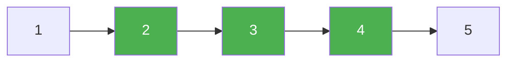

# 92. Reverse Linked List II

**Difficulty:** Medium
**Category:** Linked List

## Problem

Given the `head` of a singly linked list and two integers `left` and `right` where `left <= right`, reverse the nodes of the list from position `left` to position `right` (1-indexed), and return the reversed list.

### Example 1

```
Input: head = [1,2,3,4,5], left = 2, right = 4
Output: [1,4,3,2,5]
```



### Example 2

```
Input: head = [5], left = 1, right = 1
Output: [5]
```

### Constraints

- The number of nodes in the list is `n`.
- `1 <= n <= 500`
- `-500 <= Node.val <= 500`
- `1 <= left <= right <= n`

## Approach

Walk to the node just before position `left` using a dummy head (to handle `left == 1` uniformly). From there, repeatedly move the node right after the reversal start to the front of the reversed section — a technique often called "head insertion": each iteration detaches the next node and reinserts it immediately after `prev`, effectively reversing the sublist one node at a time without extra data structures.

## C# Solution

```csharp
public class Solution
{
    public ListNode ReverseBetween(ListNode head, int left, int right)
    {
        var dummy = new ListNode(0, head);
        var prev = dummy;

        for (int i = 1; i < left; i++)
        {
            prev = prev.next;
        }

        var current = prev.next;

        for (int i = 0; i < right - left; i++)
        {
            var moved = current.next;
            current.next = moved.next;
            moved.next = prev.next;
            prev.next = moved;
        }

        return dummy.next;
    }
}
```

## Complexity

- **Time:** `O(n)` — single pass.
- **Space:** `O(1)`.
