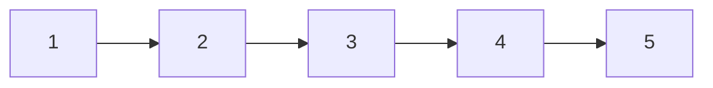

# 25. Reverse Nodes in k-Group

**Difficulty:** Hard
**Category:** Linked List, Recursion

## Problem

Given the `head` of a linked list, reverse the nodes of the list `k` at a time, and return the modified list.

`k` is a positive integer and is less than or equal to the length of the linked list. If the number of nodes is not a multiple of `k`, then the nodes left out at the end should remain as-is.

You may not alter the values in the list's nodes, only nodes themselves may be changed.

### Example 1

```
Input: head = [1,2,3,4,5], k = 2
Output: [2,1,4,3,5]
```



### Example 2

```
Input: head = [1,2,3,4,5], k = 3
Output: [3,2,1,4,5]
```

### Constraints

- The number of nodes in the list is `n`.
- `1 <= k <= n <= 5000`
- `0 <= Node.val <= 1000`

## Approach

First check whether at least `k` nodes remain from the current position; if not, leave the remainder untouched. Otherwise reverse exactly `k` nodes iteratively, then recursively process the rest of the list starting after this reversed group, attaching the recursive result to the tail of the just-reversed group (which was the original group's head).

## C# Solution

```csharp
public class Solution
{
    public ListNode ReverseKGroup(ListNode head, int k)
    {
        var node = head;
        for (int i = 0; i < k; i++)
        {
            if (node == null) return head; // fewer than k nodes remain, leave as-is
            node = node.next;
        }

        // node now points just past the k-th node; reverse the k-group
        ListNode prev = ReverseKGroup(node, k);
        ListNode current = head;

        for (int i = 0; i < k; i++)
        {
            var next = current.next;
            current.next = prev;
            prev = current;
            current = next;
        }

        return prev;
    }
}
```

## Complexity

- **Time:** `O(n)` — every node is visited a constant number of times across the recursive calls.
- **Space:** `O(n / k)` — recursion depth proportional to the number of groups.
