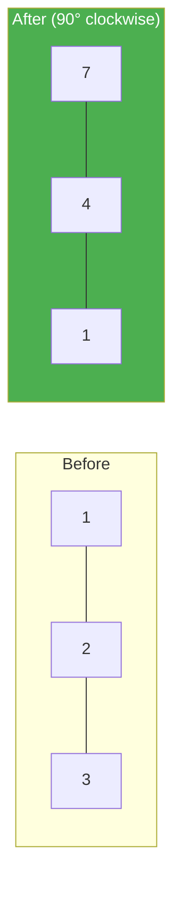

# 48. Rotate Image

**Difficulty:** Medium
**Category:** Array, Math, Matrix

## Problem

You are given an `n x n` 2D matrix representing an image. Rotate the image by 90 degrees (clockwise), in place.

### Example 1

```
Input: matrix = [[1,2,3],[4,5,6],[7,8,9]]
Output: [[7,4,1],[8,5,2],[9,6,3]]
```



### Example 2

```
Input: matrix = [[5,1,9,11],[2,4,8,10],[13,3,6,7],[15,14,12,16]]
Output: [[15,13,2,5],[14,3,4,1],[12,6,8,9],[16,7,10,11]]
```

### Constraints

- `n == matrix.length == matrix[i].length`
- `1 <= n <= 20`
- `-1000 <= matrix[i][j] <= 1000`

## Approach

A 90-degree clockwise rotation can be done in place with two simple steps: first transpose the matrix (swap `matrix[i][j]` with `matrix[j][i]`), then reverse each row. Together these two `O(n^2)` operations avoid needing a second matrix.

## C# Solution

```csharp
public class Solution
{
    public void Rotate(int[][] matrix)
    {
        int n = matrix.Length;

        for (int i = 0; i < n; i++)
        {
            for (int j = i + 1; j < n; j++)
            {
                (matrix[i][j], matrix[j][i]) = (matrix[j][i], matrix[i][j]);
            }
        }

        foreach (var row in matrix)
        {
            Array.Reverse(row);
        }
    }
}
```

## Complexity

- **Time:** `O(n^2)` — every cell is touched a constant number of times.
- **Space:** `O(1)` — in-place.
