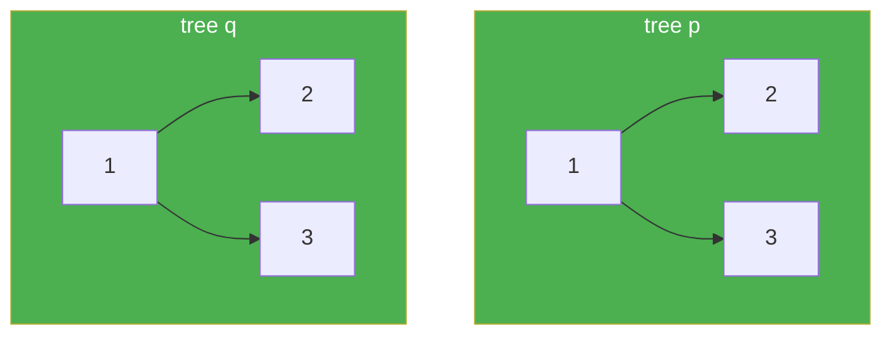

# 100. Same Tree

**Difficulty:** Easy
**Category:** Tree, Depth-First Search, Breadth-First Search, Binary Tree

## Problem

Given the roots of two binary trees `p` and `q`, write a function to check if they are the same. Two binary trees are considered the same if they are structurally identical, and the nodes have the same value.

### Example 1

```
Input: p = [1,2,3], q = [1,2,3]
Output: true
```



### Example 2

```
Input: p = [1,2], q = [1,null,2]
Output: false
```

### Constraints

- The number of nodes in both trees is in the range `[0, 100]`.
- `-10^4 <= Node.val <= 10^4`

## Approach

Recursively compare both trees node by node: if both nodes are `null`, they match at this position; if exactly one is `null`, the structures differ; otherwise the values must match and both the left and right subtrees must also be recursively identical.

## C# Solution

```csharp
public class Solution
{
    public bool IsSameTree(TreeNode p, TreeNode q)
    {
        if (p == null && q == null) return true;
        if (p == null || q == null) return false;

        return p.val == q.val
            && IsSameTree(p.left, q.left)
            && IsSameTree(p.right, q.right);
    }
}
```

## Complexity

- **Time:** `O(n)` — every node in the smaller tree is visited at most once.
- **Space:** `O(h)` — recursion depth equal to the tree height.
