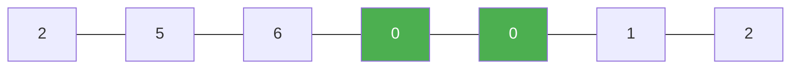

# 81. Search in Rotated Sorted Array II

**Difficulty:** Medium
**Category:** Array, Binary Search

## Problem

There is an integer array `nums` sorted in non-decreasing order (not necessarily distinct values), possibly rotated at an unknown pivot. Given the array `nums` after rotation and an integer `target`, return `true` if `target` is in `nums`, or `false` otherwise.

### Example 1

```
Input: nums = [2,5,6,0,0,1,2], target = 0
Output: true
```



### Example 2

```
Input: nums = [2,5,6,0,0,1,2], target = 3
Output: false
```

### Constraints

- `1 <= nums.length <= 5000`
- `-10^4 <= nums[i] <= 10^4`
- `nums` is guaranteed to be rotated at some pivot.
- `-10^4 <= target <= 10^4`

## Approach

Same modified binary search as Search in Rotated Sorted Array, with one extra case: when `nums[lo] == nums[mid]` and they don't equal `nums[hi]`, duplicates make it impossible to tell which half is sorted, so simply shrink the search space by incrementing `lo` (skipping one duplicate) instead of eliminating half the array.

## C# Solution

```csharp
public class Solution
{
    public bool Search(int[] nums, int target)
    {
        int lo = 0, hi = nums.Length - 1;

        while (lo <= hi)
        {
            int mid = lo + (hi - lo) / 2;
            if (nums[mid] == target) return true;

            if (nums[lo] == nums[mid] && nums[mid] == nums[hi])
            {
                lo++;
                hi--;
            }
            else if (nums[lo] <= nums[mid]) // left half is sorted
            {
                if (nums[lo] <= target && target < nums[mid]) hi = mid - 1;
                else lo = mid + 1;
            }
            else // right half is sorted
            {
                if (nums[mid] < target && target <= nums[hi]) lo = mid + 1;
                else hi = mid - 1;
            }
        }

        return false;
    }
}
```

## Complexity

- **Time:** `O(log n)` average, `O(n)` worst case (all duplicates, e.g. `[1,1,1,1,1]`).
- **Space:** `O(1)`.
