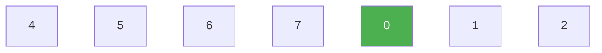

# 33. Search in Rotated Sorted Array

**Difficulty:** Medium
**Category:** Array, Binary Search

## Problem

There is an integer array `nums` sorted in ascending order (with distinct values), possibly rotated at an unknown pivot index. Given the array `nums` after the rotation and an integer `target`, return the index of `target` if it is in `nums`, or `-1` if it is not. You must write an algorithm with `O(log n)` runtime complexity.

### Example 1

```
Input: nums = [4,5,6,7,0,1,2], target = 0
Output: 4
```



### Example 2

```
Input: nums = [4,5,6,7,0,1,2], target = 3
Output: -1
```

### Constraints

- `1 <= nums.length <= 5000`
- `-10^4 <= nums[i] <= 10^4`
- All values of `nums` are unique.
- `nums` is an ascending array that is possibly rotated.
- `-10^4 <= target <= 10^4`

## Approach

Run a modified binary search: at each step, one half of `[lo, hi]` is guaranteed to be normally sorted. Determine which half is sorted by comparing `nums[lo]` and `nums[mid]`, then check whether `target` falls within that sorted half's range to decide which half to keep searching.

## C# Solution

```csharp
public class Solution
{
    public int Search(int[] nums, int target)
    {
        int lo = 0, hi = nums.Length - 1;

        while (lo <= hi)
        {
            int mid = lo + (hi - lo) / 2;
            if (nums[mid] == target) return mid;

            if (nums[lo] <= nums[mid]) // left half is sorted
            {
                if (nums[lo] <= target && target < nums[mid]) hi = mid - 1;
                else lo = mid + 1;
            }
            else // right half is sorted
            {
                if (nums[mid] < target && target <= nums[hi]) lo = mid + 1;
                else hi = mid - 1;
            }
        }

        return -1;
    }
}
```

## Complexity

- **Time:** `O(log n)` — standard binary search halving.
- **Space:** `O(1)`.
