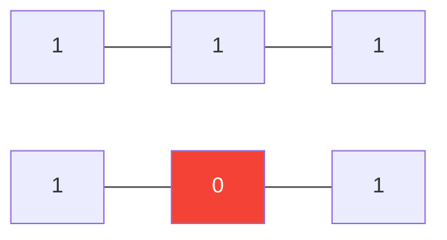

# 73. Set Matrix Zeroes

**Difficulty:** Medium
**Category:** Array, Hash Table, Matrix

## Problem

Given an `m x n` integer matrix, if an element is `0`, set its entire row and column to `0`. You must do it in place.

### Example 1

```
Input: matrix = [[1,1,1],[1,0,1],[1,1,1]]
Output: [[1,0,1],[0,0,0],[1,0,1]]
```



### Example 2

```
Input: matrix = [[0,1,2,0],[3,4,5,2],[1,3,1,5]]
Output: [[0,0,0,0],[0,4,5,0],[0,3,1,0]]
```

### Constraints

- `m == matrix.length`
- `n == matrix[0].length`
- `1 <= m, n <= 200`
- `-2^31 <= matrix[i][j] <= 2^31 - 1`

## Approach

To achieve `O(1)` extra space, use the first row and first column of the matrix itself as markers for which rows/columns should become zero (tracking separately whether the first row/column originally contained a zero, since they double as storage). First mark, then zero out the interior based on the markers, then handle the first row/column last.

## C# Solution

```csharp
public class Solution
{
    public void SetZeroes(int[][] matrix)
    {
        int m = matrix.Length, n = matrix[0].Length;
        bool firstRowHasZero = false, firstColHasZero = false;

        for (int col = 0; col < n; col++) if (matrix[0][col] == 0) firstRowHasZero = true;
        for (int row = 0; row < m; row++) if (matrix[row][0] == 0) firstColHasZero = true;

        for (int row = 1; row < m; row++)
        {
            for (int col = 1; col < n; col++)
            {
                if (matrix[row][col] == 0)
                {
                    matrix[row][0] = 0;
                    matrix[0][col] = 0;
                }
            }
        }

        for (int row = 1; row < m; row++)
        {
            for (int col = 1; col < n; col++)
            {
                if (matrix[row][0] == 0 || matrix[0][col] == 0)
                {
                    matrix[row][col] = 0;
                }
            }
        }

        if (firstRowHasZero) for (int col = 0; col < n; col++) matrix[0][col] = 0;
        if (firstColHasZero) for (int row = 0; row < m; row++) matrix[row][0] = 0;
    }
}
```

## Complexity

- **Time:** `O(m * n)` — a constant number of passes over the matrix.
- **Space:** `O(1)` — the first row/column are reused as marker storage.
