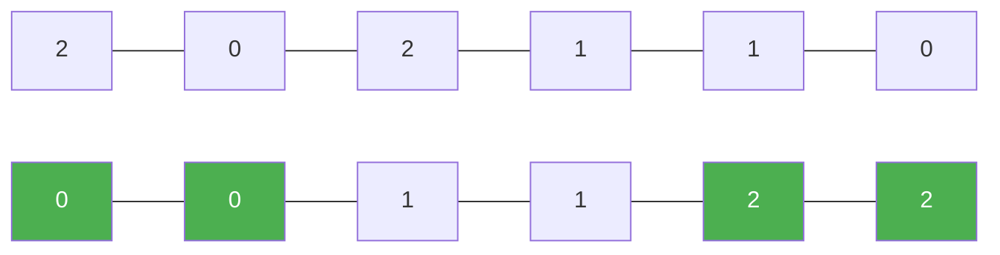

# 75. Sort Colors

**Difficulty:** Medium
**Category:** Array, Two Pointers, Sorting

## Problem

Given an array `nums` with `n` objects colored red, white, or blue (represented by the integers `0`, `1`, and `2`), sort them in place so that objects of the same color are adjacent, in the order red, white, and blue. You must solve this without using the library's sort function.

### Example 1

```
Input: nums = [2,0,2,1,1,0]
Output: [0,0,1,1,2,2]
```



### Example 2

```
Input: nums = [2,0,1]
Output: [0,1,2]
```

### Constraints

- `n == nums.length`
- `1 <= n <= 300`
- `nums[i]` is `0`, `1`, or `2`.

## Approach

This is the Dutch National Flag algorithm: maintain three pointers, `low`, `mid`, and `high`. `mid` scans the array; when it sees a `0`, swap it to the `low` region and advance both `low` and `mid`; when it sees a `2`, swap it to the `high` region and shrink `high` (without advancing `mid`, since the swapped-in value still needs to be examined); a `1` is already in place, so just advance `mid`.

## C# Solution

```csharp
public class Solution
{
    public void SortColors(int[] nums)
    {
        int low = 0, mid = 0, high = nums.Length - 1;

        while (mid <= high)
        {
            if (nums[mid] == 0)
            {
                (nums[low], nums[mid]) = (nums[mid], nums[low]);
                low++;
                mid++;
            }
            else if (nums[mid] == 1)
            {
                mid++;
            }
            else
            {
                (nums[mid], nums[high]) = (nums[high], nums[mid]);
                high--;
            }
        }
    }
}
```

## Complexity

- **Time:** `O(n)` — single pass.
- **Space:** `O(1)` — in-place.
