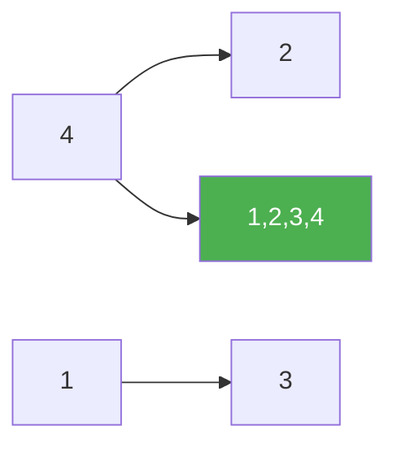

# 148. Sort List

**Difficulty:** Medium
**Category:** Linked List, Two Pointers, Dynamic Programming, Sorting, Merge Sort

## Problem

Given the `head` of a linked list, return the list after sorting it in ascending order. Aim for `O(n log n)` time and `O(1)` extra space.

### Example 1

```
Input: head = [4,2,1,3]
Output: [1,2,3,4]
```



### Example 2

```
Input: head = [-1,5,3,4,0]
Output: [-1,0,3,4,5]
```

### Constraints

- The number of nodes is in the range `[0, 5 * 10^4]`.
- `-10^5 <= Node.val <= 10^5`

## Approach

Bottom-up merge sort on linked lists: recursively split the list in half using slow/fast pointers, sort each half, then merge the two sorted halves — the same divide-and-conquer structure as array merge sort, but splitting/merging pointers instead of array indices.

## C# Solution

```csharp
public class Solution
{
    public ListNode SortList(ListNode head)
    {
        if (head == null || head.next == null) return head;

        var slow = head;
        var fast = head.next;
        while (fast != null && fast.next != null)
        {
            slow = slow.next;
            fast = fast.next.next;
        }

        var secondHalf = slow.next;
        slow.next = null;

        var left = SortList(head);
        var right = SortList(secondHalf);

        return Merge(left, right);
    }

    private ListNode Merge(ListNode a, ListNode b)
    {
        var dummy = new ListNode();
        var current = dummy;

        while (a != null && b != null)
        {
            if (a.val <= b.val)
            {
                current.next = a;
                a = a.next;
            }
            else
            {
                current.next = b;
                b = b.next;
            }
            current = current.next;
        }

        current.next = a ?? b;
        return dummy.next;
    }
}
```

## Complexity

- **Time:** `O(n log n)` — standard merge sort recurrence.
- **Space:** `O(log n)` — recursion depth (the merge itself relinks nodes in place).
