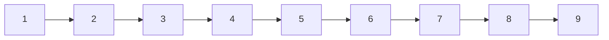

# 59. Spiral Matrix II

**Difficulty:** Medium
**Category:** Array, Matrix, Simulation

## Problem

Given a positive integer `n`, generate an `n x n` matrix filled with elements from `1` to `n^2` in spiral order.

### Example 1

```
Input: n = 3
Output: [[1,2,3],[8,9,4],[7,6,5]]
```



### Example 2

```
Input: n = 1
Output: [[1]]
```

### Constraints

- `1 <= n <= 20`

## Approach

Mirror the traversal pattern from Spiral Matrix, but instead of reading values, write increasing numbers into the matrix as the four shrinking boundaries (`top`, `bottom`, `left`, `right`) are walked in the same top → right → bottom → left order.

## C# Solution

```csharp
public class Solution
{
    public int[][] GenerateMatrix(int n)
    {
        var matrix = new int[n][];
        for (int i = 0; i < n; i++) matrix[i] = new int[n];

        int top = 0, bottom = n - 1, left = 0, right = n - 1;
        int value = 1;

        while (top <= bottom && left <= right)
        {
            for (int col = left; col <= right; col++) matrix[top][col] = value++;
            top++;

            for (int row = top; row <= bottom; row++) matrix[row][right] = value++;
            right--;

            if (top <= bottom)
            {
                for (int col = right; col >= left; col--) matrix[bottom][col] = value++;
                bottom--;
            }

            if (left <= right)
            {
                for (int row = bottom; row >= top; row--) matrix[row][left] = value++;
                left++;
            }
        }

        return matrix;
    }
}
```

## Complexity

- **Time:** `O(n^2)` — every cell is written exactly once.
- **Space:** `O(1)` extra, excluding the output matrix.
