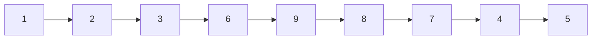

# 54. Spiral Matrix

**Difficulty:** Medium
**Category:** Array, Matrix, Simulation

## Problem

Given an `m x n` matrix, return all elements of the matrix in spiral order.

### Example 1

```
Input: matrix = [[1,2,3],[4,5,6],[7,8,9]]
Output: [1,2,3,6,9,8,7,4,5]
```



### Example 2

```
Input: matrix = [[1,2,3,4],[5,6,7,8],[9,10,11,12]]
Output: [1,2,3,4,8,12,11,10,9,5,6,7]
```

### Constraints

- `m == matrix.length`
- `n == matrix[i].length`
- `1 <= m, n <= 10`
- `-100 <= matrix[i][j] <= 100`

## Approach

Maintain four boundaries (`top`, `bottom`, `left`, `right`). Traverse the top row left-to-right, the right column top-to-bottom, the bottom row right-to-left, and the left column bottom-to-top, shrinking the corresponding boundary after each pass. Stop once the boundaries cross.

## C# Solution

```csharp
public class Solution
{
    public IList<int> SpiralOrder(int[][] matrix)
    {
        var result = new List<int>();
        int top = 0, bottom = matrix.Length - 1;
        int left = 0, right = matrix[0].Length - 1;

        while (top <= bottom && left <= right)
        {
            for (int col = left; col <= right; col++) result.Add(matrix[top][col]);
            top++;

            for (int row = top; row <= bottom; row++) result.Add(matrix[row][right]);
            right--;

            if (top <= bottom)
            {
                for (int col = right; col >= left; col--) result.Add(matrix[bottom][col]);
                bottom--;
            }

            if (left <= right)
            {
                for (int row = bottom; row >= top; row--) result.Add(matrix[row][left]);
                left++;
            }
        }

        return result;
    }
}
```

## Complexity

- **Time:** `O(m * n)` — every cell is visited exactly once.
- **Space:** `O(1)` extra, excluding the output list.
