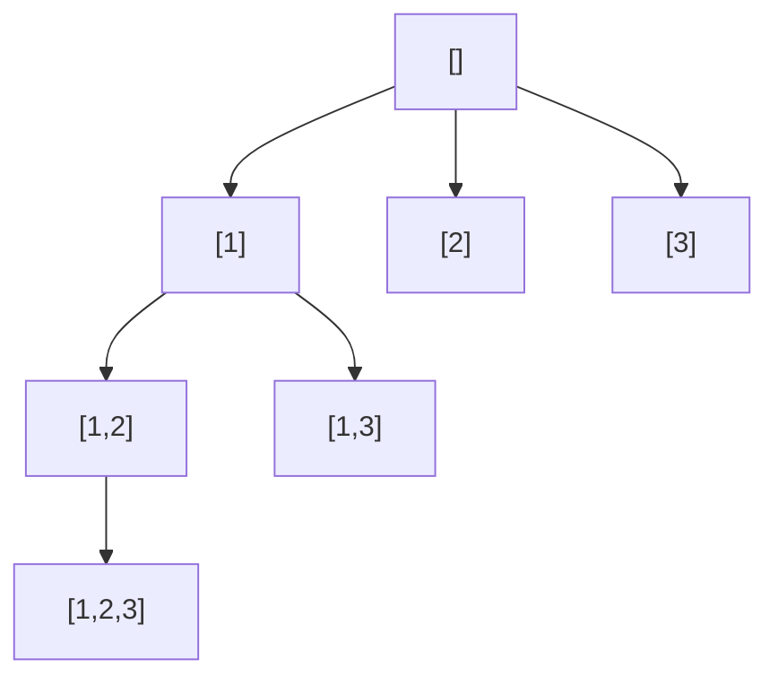

# 78. Subsets

**Difficulty:** Medium
**Category:** Array, Backtracking, Bit Manipulation

## Problem

Given an integer array `nums` of unique elements, return all possible subsets (the power set). The solution set must not contain duplicate subsets.

### Example 1

```
Input: nums = [1,2,3]
Output: [[],[1],[2],[1,2],[3],[1,3],[2,3],[1,2,3]]
```



### Example 2

```
Input: nums = [0]
Output: [[],[0]]
```

### Constraints

- `1 <= nums.length <= 10`
- `-10 <= nums[i] <= 10`
- All the numbers of `nums` are unique.

## Approach

Backtrack while deciding, index by index, whether to include the current element in the running subset. Every recursive call itself represents a valid subset, so add `current` to the result immediately upon entering the call, then branch by including or excluding `nums[index]`.

## C# Solution

```csharp
public class Solution
{
    public IList<IList<int>> Subsets(int[] nums)
    {
        var result = new List<IList<int>>();
        Backtrack(nums, 0, new List<int>(), result);
        return result;
    }

    private void Backtrack(int[] nums, int index, List<int> current, List<IList<int>> result)
    {
        result.Add(new List<int>(current));

        for (int i = index; i < nums.Length; i++)
        {
            current.Add(nums[i]);
            Backtrack(nums, i + 1, current, result);
            current.RemoveAt(current.Count - 1);
        }
    }
}
```

## Complexity

- **Time:** `O(n * 2^n)` — `2^n` subsets, each costing up to `O(n)` to copy.
- **Space:** `O(n)` for recursion depth, excluding the output.
