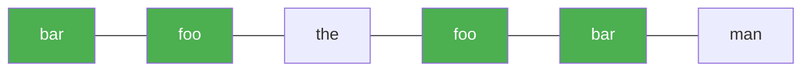

# 30. Substring with Concatenation of All Words

**Difficulty:** Hard
**Category:** Hash Table, String, Sliding Window

## Problem

You are given a string `s` and an array of strings `words`. All the strings in `words` are of the same length.

A concatenated substring in `s` is a substring that contains all the strings of any permutation of `words` concatenated.

Return the starting indices of all the concatenated substrings in `s`, in any order.

### Example 1

```
Input: s = "barfoothefoobarman", words = ["foo","bar"]
Output: [0,9]
Explanation: The substring starting at 0 is "barfoo" and the substring starting at 9 is "foobar".
```



### Example 2

```
Input: s = "wordgoodgoodgoodbestword", words = ["word","good","best","word"]
Output: []
```

### Constraints

- `1 <= s.length <= 10^4`
- `1 <= words.length <= 5000`
- `1 <= words[i].length <= 30`
- `s` and `words[i]` consist of lowercase English letters.

## Approach

Since every word has the same length `wordLen`, slide a window of size `wordLen * words.Count` across `s`. For each of the `wordLen` possible starting offsets, use a two-pointer sliding window that tracks word counts with a dictionary, expanding/shrinking to check whether the current window is an exact permutation of `words`.

## C# Solution

```csharp
public class Solution
{
    public IList<int> FindSubstring(string s, string[] words)
    {
        var result = new List<int>();
        if (words.Length == 0) return result;

        int wordLen = words[0].Length;
        int numWords = words.Length;
        int windowLen = wordLen * numWords;
        if (s.Length < windowLen) return result;

        var wordCount = new Dictionary<string, int>();
        foreach (var w in words)
        {
            wordCount[w] = wordCount.GetValueOrDefault(w) + 1;
        }

        for (int offset = 0; offset < wordLen; offset++)
        {
            int left = offset, count = 0;
            var windowCount = new Dictionary<string, int>();

            for (int right = offset; right + wordLen <= s.Length; right += wordLen)
            {
                string word = s.Substring(right, wordLen);

                if (wordCount.ContainsKey(word))
                {
                    windowCount[word] = windowCount.GetValueOrDefault(word) + 1;
                    count++;

                    while (windowCount[word] > wordCount[word])
                    {
                        string leftWord = s.Substring(left, wordLen);
                        windowCount[leftWord]--;
                        left += wordLen;
                        count--;
                    }

                    if (count == numWords)
                    {
                        result.Add(left);
                        string leftWord = s.Substring(left, wordLen);
                        windowCount[leftWord]--;
                        left += wordLen;
                        count--;
                    }
                }
                else
                {
                    windowCount.Clear();
                    count = 0;
                    left = right + wordLen;
                }
            }
        }

        return result;
    }
}
```

## Complexity

- **Time:** `O(n * wordLen)` — `wordLen` offsets, each performing a linear sliding-window scan over `s`.
- **Space:** `O(numWords * wordLen)` — for the word-count dictionaries.
