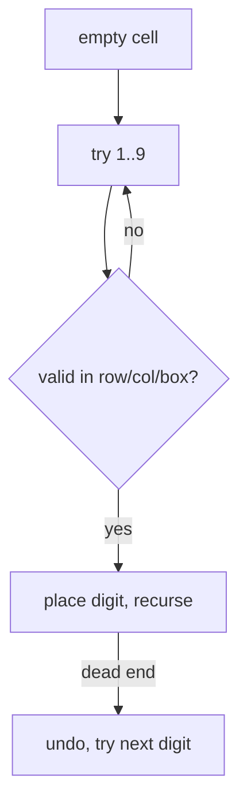

# 37. Sudoku Solver

**Difficulty:** Hard
**Category:** Array, Backtracking, Matrix

## Problem

Write a program to solve a Sudoku puzzle by filling the empty cells so the final grid satisfies the standard Sudoku rules (each row, column, and `3 x 3` sub-box contains the digits `1-9` exactly once). The board is guaranteed to have a single solution.

### Example 1

```
Input: a partially filled 9x9 board
Output: the fully solved 9x9 board, modified in place
```



### Constraints

- `board.length == 9`
- `board[i].length == 9`
- `board[i][j]` is a digit `1-9` or `'.'`.
- It is guaranteed that the input board has only one solution.

## Approach

Classic backtracking: find the next empty cell, try each digit `1`-`9`, check validity against the row/column/box, and if valid, place it and recurse to the next empty cell. If a placement leads to a dead end (recursion returns false for every digit), undo it (`'.'`) and backtrack to try a different digit at the previous cell.

## C# Solution

```csharp
public class Solution
{
    public void SolveSudoku(char[][] board)
    {
        Solve(board);
    }

    private bool Solve(char[][] board)
    {
        for (int row = 0; row < 9; row++)
        {
            for (int col = 0; col < 9; col++)
            {
                if (board[row][col] != '.') continue;

                for (char digit = '1'; digit <= '9'; digit++)
                {
                    if (IsValid(board, row, col, digit))
                    {
                        board[row][col] = digit;

                        if (Solve(board)) return true;

                        board[row][col] = '.'; // backtrack
                    }
                }

                return false; // no digit works here
            }
        }

        return true; // no empty cells left
    }

    private bool IsValid(char[][] board, int row, int col, char digit)
    {
        int boxRow = (row / 3) * 3, boxCol = (col / 3) * 3;

        for (int i = 0; i < 9; i++)
        {
            if (board[row][i] == digit) return false;
            if (board[i][col] == digit) return false;
            if (board[boxRow + i / 3][boxCol + i % 3] == digit) return false;
        }

        return true;
    }
}
```

## Complexity

- **Time:** `O(9^m)` in the worst case, where `m` is the number of empty cells — backtracking search space, though heavily pruned in practice by the validity check.
- **Space:** `O(m)` — recursion depth bounded by the number of empty cells.
