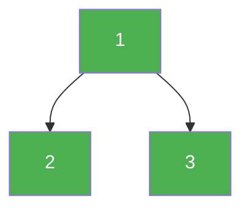

# 129. Sum Root to Leaf Numbers

**Difficulty:** Medium
**Category:** Tree, Depth-First Search, Binary Tree

## Problem

Each root-to-leaf path in a binary tree represents a number formed by concatenating the digits along the path. Given the `root` of a binary tree containing digits `0-9`, return the total sum of all root-to-leaf numbers.

### Example 1

```
Input: root = [1,2,3]
Output: 25
Explanation: path 1->2 represents 12, path 1->3 represents 13, total 12 + 13 = 25.
```



### Example 2

```
Input: root = [4,9,0,5,1]
Output: 1026
```

### Constraints

- The number of nodes in the tree is in the range `[1, 1000]`.
- `0 <= Node.val <= 9`

## Approach

Carry the number formed so far as a recursion parameter, extending it by one digit at each step (`runningValue * 10 + node.val`). When a leaf is reached, that running value is a complete root-to-leaf number and gets added to the total; internal nodes just pass the extended value down to both children.

## C# Solution

```csharp
public class Solution
{
    public int SumNumbers(TreeNode root)
    {
        return Dfs(root, 0);
    }

    private int Dfs(TreeNode node, int runningValue)
    {
        if (node == null) return 0;

        runningValue = runningValue * 10 + node.val;

        if (node.left == null && node.right == null)
        {
            return runningValue;
        }

        return Dfs(node.left, runningValue) + Dfs(node.right, runningValue);
    }
}
```

## Complexity

- **Time:** `O(n)` — every node is visited once.
- **Space:** `O(h)` — recursion depth equal to the tree height.
