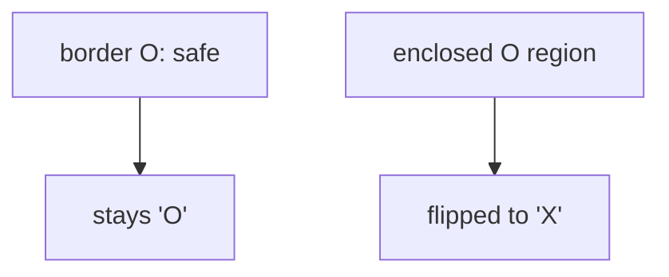

# 130. Surrounded Regions

**Difficulty:** Medium
**Category:** Array, Depth-First Search, Breadth-First Search, Union Find, Matrix

## Problem

Given an `m x n` matrix `board` containing `'X'` and `'O'`, capture all regions of `'O'`s that are completely surrounded by `'X'`s by flipping them to `'X'` in place. A region is not captured if it connects (up/down/left/right) to an `'O'` on the border of the board.

### Example 1

```
Input: board = [["X","X","X","X"],["X","O","O","X"],["X","X","O","X"],["X","O","X","X"]]
Output: [["X","X","X","X"],["X","X","X","X"],["X","X","X","X"],["X","O","X","X"]]
Explanation: the O at the bottom-left touches the border, so it stays. The rest form a fully enclosed region and get captured.
```



### Example 2

```
Input: board = [["X"]]
Output: [["X"]]
```

### Constraints

- `m == board.length`
- `n == board[i].length`
- `1 <= m, n <= 200`
- `board[i][j]` is `'X'` or `'O'`.

## Approach

Any `'O'` connected (directly or transitively) to a border `'O'` is safe and must be preserved. Run a flood fill (DFS/BFS) starting from every `'O'` on the border, temporarily marking all reachable `'O'`s with a placeholder character (e.g. `'#'`). Afterward, any `'O'` still remaining is fully enclosed and gets flipped to `'X'`, while every `'#'` is restored back to `'O'`.

## C# Solution

```csharp
public class Solution
{
    public void Solve(char[][] board)
    {
        int rows = board.Length, cols = board[0].Length;

        for (int row = 0; row < rows; row++)
        {
            Mark(board, row, 0);
            Mark(board, row, cols - 1);
        }

        for (int col = 0; col < cols; col++)
        {
            Mark(board, 0, col);
            Mark(board, rows - 1, col);
        }

        for (int row = 0; row < rows; row++)
        {
            for (int col = 0; col < cols; col++)
            {
                if (board[row][col] == 'O') board[row][col] = 'X';
                else if (board[row][col] == '#') board[row][col] = 'O';
            }
        }
    }

    private void Mark(char[][] board, int row, int col)
    {
        if (row < 0 || row >= board.Length || col < 0 || col >= board[0].Length || board[row][col] != 'O')
        {
            return;
        }

        board[row][col] = '#';

        Mark(board, row + 1, col);
        Mark(board, row - 1, col);
        Mark(board, row, col + 1);
        Mark(board, row, col - 1);
    }
}
```

## Complexity

- **Time:** `O(m * n)` — every cell is visited a constant number of times.
- **Space:** `O(m * n)` — worst case recursion depth for the flood fill.
