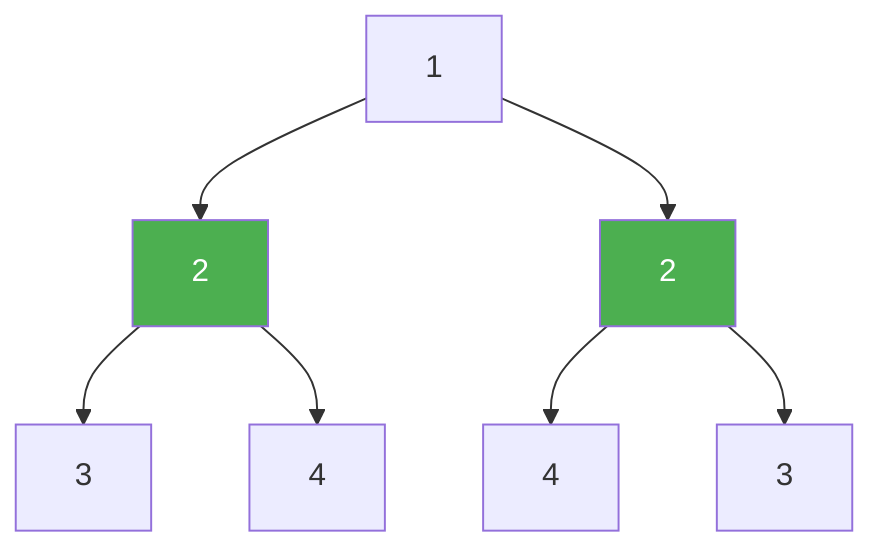

# 101. Symmetric Tree

**Difficulty:** Easy
**Category:** Tree, Depth-First Search, Breadth-First Search, Binary Tree

## Problem

Given the `root` of a binary tree, check whether it is a mirror of itself around its center (i.e., symmetric around the vertical axis).

### Example 1

```
Input: root = [1,2,2,3,4,4,3]
Output: true
```



### Example 2

```
Input: root = [1,2,2,null,3,null,3]
Output: false
```

### Constraints

- The number of nodes in the tree is in the range `[1, 1000]`.
- `-100 <= Node.val <= 100`

## Approach

Compare the left and right subtrees recursively as mirror images: two subtrees are mirrors when their root values match, the left subtree's left child mirrors the right subtree's right child, and the left subtree's right child mirrors the right subtree's left child.

## C# Solution

```csharp
public class TreeNode
{
    public int val;
    public TreeNode left;
    public TreeNode right;
    public TreeNode(int val = 0, TreeNode left = null, TreeNode right = null)
    {
        this.val = val;
        this.left = left;
        this.right = right;
    }
}

public class Solution
{
    public bool IsSymmetric(TreeNode root)
    {
        return root == null || IsMirror(root.left, root.right);
    }

    private bool IsMirror(TreeNode left, TreeNode right)
    {
        if (left == null && right == null) return true;
        if (left == null || right == null) return false;

        return left.val == right.val
            && IsMirror(left.left, right.right)
            && IsMirror(left.right, right.left);
    }
}
```

## Complexity

- **Time:** `O(n)` — every node is visited once.
- **Space:** `O(h)` — recursion depth equal to the tree height.
