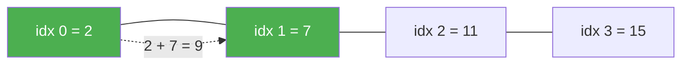
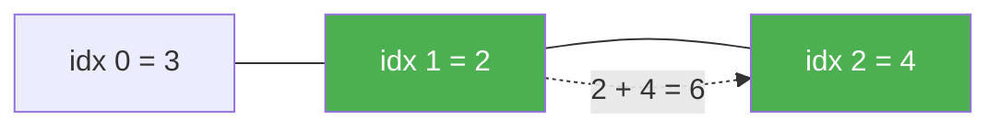
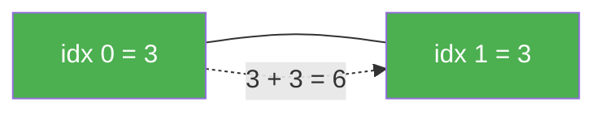

# 1. Two Sum

**Difficulty:** Easy
**Category:** Array, Hash Table

## Problem

You are given an array of integers `nums` and an integer `target`, return indices of the two numbers such that they add up to `target`.

You may assume that each input would have exactly one solution, and you may not use the same element twice.

You can return the answer in any order.

### Example 1

```
Input: nums = [2,7,11,15], target = 9
Output: [0,1]
Explanation: Because nums[0] + nums[1] == 9, we return [0, 1].
```



### Example 2

```
Input: nums = [3,2,4], target = 6
Output: [1,2]
```



### Example 3

```
Input: nums = [3,3], target = 6
Output: [0,1]
```



### Constraints

- `2 <= nums.length <= 10^4`
- `-10^9 <= nums[i] <= 10^9`
- `-10^9 <= target <= 10^9`
- Only one valid answer exists.

Follow-up: Can you come up with an algorithm that is less than `O(n^2)` time complexity?

## Approach

A brute-force scan checks every pair of indices, giving `O(n^2)` time.

The faster approach uses a hash map (`Dictionary<int,int>` in C#) to store each value's index as we iterate once. For every element, check whether `target - nums[i]` was already seen; if so, we found the pair immediately.

## C# Solution

```csharp
public class Solution
{
    public int[] TwoSum(int[] nums, int target)
    {
        var seen = new Dictionary<int, int>(); // value -> index

        for (int i = 0; i < nums.Length; i++)
        {
            int complement = target - nums[i];

            if (seen.TryGetValue(complement, out int complementIndex))
            {
                return new[] { complementIndex, i };
            }

            seen[nums[i]] = i;
        }

        throw new ArgumentException("No two sum solution exists for the given input.");
    }
}
```

### Usage

```csharp
var solution = new Solution();
int[] result = solution.TwoSum(new[] { 2, 7, 11, 15 }, 9); // [0, 1]
```

## Complexity

- **Time:** `O(n)` — single pass through the array with `O(1)` dictionary lookups/inserts.
- **Space:** `O(n)` — the dictionary stores up to `n` entries in the worst case.
