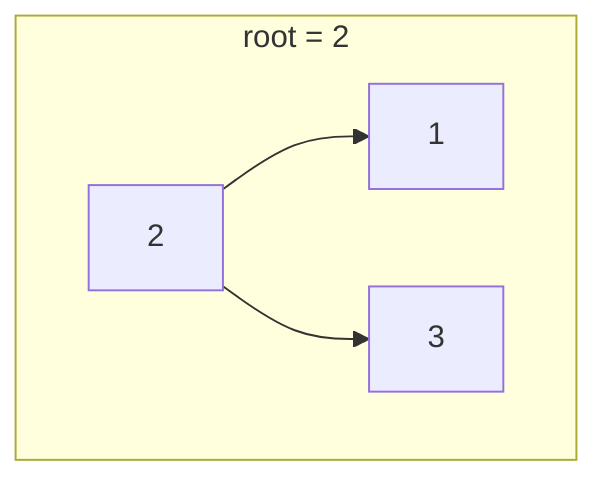

# 95. Unique Binary Search Trees II

**Difficulty:** Medium
**Category:** Dynamic Programming, Backtracking, Tree, Binary Search Tree

## Problem

Given an integer `n`, return all the structurally unique binary search trees (BSTs) which have exactly `n` nodes with unique values from `1` to `n`. Return the answer as a list of the trees' root nodes, in any order.

### Example 1

```
Input: n = 3
Output: [[1,null,2,null,3],[1,null,3,2],[2,1,3],[3,1,null,null,2],[3,2,null,1]]
```



### Example 2

```
Input: n = 1
Output: [[1]]
```

### Constraints

- `1 <= n <= 8`

## Approach

For every value `root` chosen from a range `[low, high]`, recursively build all possible left subtrees from `[low, root-1]` and all possible right subtrees from `[root+1, high]`, then combine every left/right subtree pair into a distinct tree rooted at `root`. Memoizing on `(low, high)` avoids recomputing the same subranges repeatedly.

## C# Solution

```csharp
public class Solution
{
    public IList<TreeNode> GenerateTrees(int n)
    {
        if (n == 0) return new List<TreeNode>();
        return Build(1, n);
    }

    private List<TreeNode> Build(int low, int high)
    {
        var result = new List<TreeNode>();

        if (low > high)
        {
            result.Add(null); // represents an empty subtree
            return result;
        }

        for (int root = low; root <= high; root++)
        {
            var leftSubtrees = Build(low, root - 1);
            var rightSubtrees = Build(root + 1, high);

            foreach (var left in leftSubtrees)
            {
                foreach (var right in rightSubtrees)
                {
                    result.Add(new TreeNode(root, left, right));
                }
            }
        }

        return result;
    }
}
```

## Complexity

- **Time:** `O(4^n / n^1.5)` — bounded by the `n`-th Catalan number of distinct BST shapes.
- **Space:** `O(4^n / n^1.5)` — for storing all generated trees.
