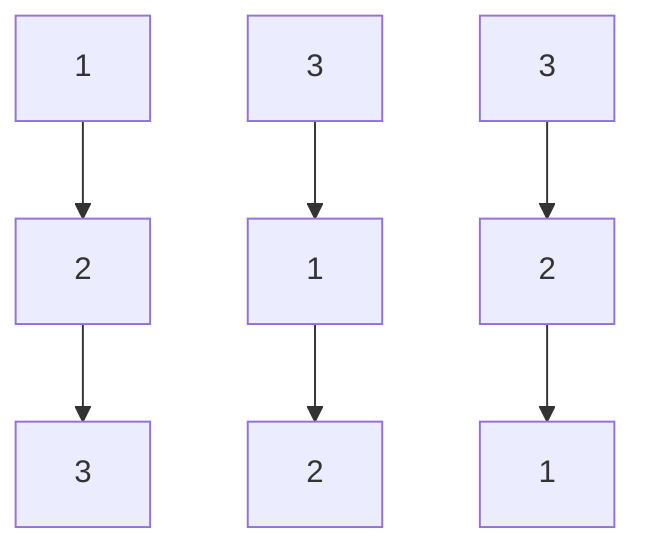

# 96. Unique Binary Search Trees

**Difficulty:** Medium
**Category:** Math, Dynamic Programming, Binary Search Tree, Binary Tree

## Problem

Given an integer `n`, return the number of structurally unique binary search trees (BSTs) which have exactly `n` nodes with unique values from `1` to `n`.

### Example 1

```
Input: n = 3
Output: 5
```



### Example 2

```
Input: n = 1
Output: 1
```

### Constraints

- `1 <= n <= 19`

## Approach

Let `dp[i]` be the number of unique BSTs that can be built with `i` nodes. Choosing each value `1..i` in turn as the root, the left subtree uses `k - 1` nodes and the right subtree uses `i - k` nodes, contributing `dp[k-1] * dp[i-k]` trees for that root choice. Summing over all root choices gives `dp[i]` — this is exactly the Catalan number recurrence.

## C# Solution

```csharp
public class Solution
{
    public int NumTrees(int n)
    {
        var dp = new int[n + 1];
        dp[0] = 1;

        for (int nodes = 1; nodes <= n; nodes++)
        {
            for (int root = 1; root <= nodes; root++)
            {
                dp[nodes] += dp[root - 1] * dp[nodes - root];
            }
        }

        return dp[n];
    }
}
```

## Complexity

- **Time:** `O(n^2)` — nested loop over node counts and root choices.
- **Space:** `O(n)` — for the DP array.
