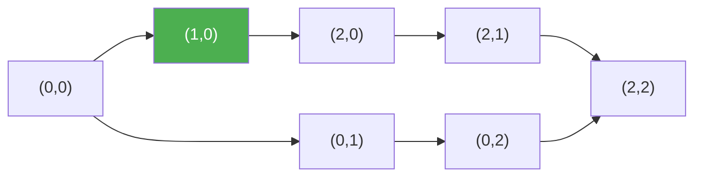

# 63. Unique Paths II

**Difficulty:** Medium
**Category:** Array, Dynamic Programming, Matrix

## Problem

You are given an `m x n` integer array `grid`. There is a robot initially located at the top-left corner. The robot tries to move to the bottom-right corner, moving only down or right. An obstacle is marked as `1` and empty space is marked as `0` in the grid — the robot cannot pass through obstacle cells. Return the number of possible unique paths.

### Example 1

```
Input: obstacleGrid = [[0,0,0],[0,1,0],[0,0,0]]
Output: 2
```



### Example 2

```
Input: obstacleGrid = [[0,1],[0,0]]
Output: 1
```

### Constraints

- `m == obstacleGrid.length`
- `n == obstacleGrid[i].length`
- `1 <= m, n <= 100`
- `obstacleGrid[i][j]` is `0` or `1`.

## Approach

Same DP recurrence as Unique Paths (`dp[col] += dp[col-1]`), except any cell containing an obstacle has `dp[col] = 0` (unreachable), since no path may pass through it.

## C# Solution

```csharp
public class Solution
{
    public int UniquePathsWithObstacles(int[][] obstacleGrid)
    {
        int m = obstacleGrid.Length, n = obstacleGrid[0].Length;
        var dp = new int[n];
        dp[0] = obstacleGrid[0][0] == 1 ? 0 : 1;

        for (int col = 1; col < n; col++)
        {
            dp[col] = obstacleGrid[0][col] == 1 ? 0 : dp[col - 1];
        }

        for (int row = 1; row < m; row++)
        {
            dp[0] = obstacleGrid[row][0] == 1 ? 0 : dp[0];

            for (int col = 1; col < n; col++)
            {
                dp[col] = obstacleGrid[row][col] == 1 ? 0 : dp[col] + dp[col - 1];
            }
        }

        return dp[n - 1];
    }
}
```

## Complexity

- **Time:** `O(m * n)` — fills the DP table once.
- **Space:** `O(n)` — a single row of the DP table.
