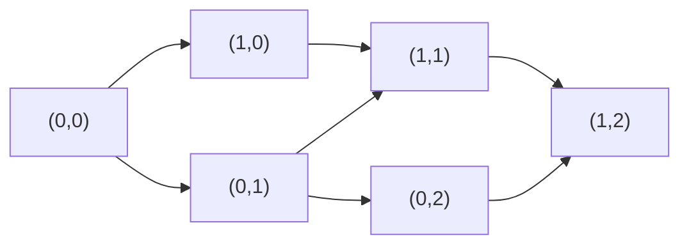

# 62. Unique Paths

**Difficulty:** Medium
**Category:** Math, Dynamic Programming, Combinatorics

## Problem

There is a robot on an `m x n` grid, starting at the top-left corner. The robot can only move either down or right at any point in time and is trying to reach the bottom-right corner. Given the two integers `m` and `n`, return the number of possible unique paths.

### Example 1

```
Input: m = 3, n = 7
Output: 28
```



### Example 2

```
Input: m = 3, n = 2
Output: 3
```

### Constraints

- `1 <= m, n <= 100`

## Approach

`dp[row][col]` is the number of ways to reach that cell, equal to `dp[row-1][col] + dp[row][col-1]` (arriving from above or from the left). The first row and first column are all `1` since there is only one way to reach them (a straight line). This can be compressed into a single 1-D array since each row only depends on the previous row.

## C# Solution

```csharp
public class Solution
{
    public int UniquePaths(int m, int n)
    {
        var dp = new int[n];
        Array.Fill(dp, 1);

        for (int row = 1; row < m; row++)
        {
            for (int col = 1; col < n; col++)
            {
                dp[col] += dp[col - 1];
            }
        }

        return dp[n - 1];
    }
}
```

## Complexity

- **Time:** `O(m * n)` — fills the DP table once.
- **Space:** `O(n)` — a single row of the DP table.
