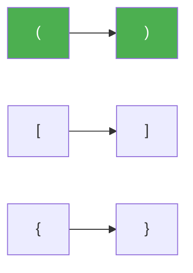

# 20. Valid Parentheses

**Difficulty:** Easy
**Category:** String, Stack

## Problem

Given a string `s` containing just the characters `'('`, `')'`, `'{'`, `'}'`, `'['` and `']'`, determine if the input string is valid.

An input string is valid if:

1. Open brackets are closed by the same type of bracket.
2. Open brackets are closed in the correct order.
3. Every close bracket has a corresponding open bracket of the same type.

### Example 1

```
Input: s = "()"
Output: true
```

### Example 2

```
Input: s = "()[]{}"
Output: true
```



### Example 3

```
Input: s = "(]"
Output: false
```

### Constraints

- `1 <= s.length <= 10^4`
- `s` consists of parentheses only `'()[]{}'`.

## Approach

Push every opening bracket onto a stack. For every closing bracket, pop the stack and check that it matches the expected opening bracket; if not (or the stack is empty), the string is invalid. At the end, the stack must be empty for the string to be valid.

## C# Solution

```csharp
public class Solution
{
    private static readonly Dictionary<char, char> Pairs = new()
    {
        [')'] = '(', [']'] = '[', ['}'] = '{',
    };

    public bool IsValid(string s)
    {
        var stack = new Stack<char>();

        foreach (char c in s)
        {
            if (Pairs.ContainsValue(c))
            {
                stack.Push(c);
            }
            else if (Pairs.TryGetValue(c, out char expectedOpen))
            {
                if (stack.Count == 0 || stack.Pop() != expectedOpen)
                {
                    return false;
                }
            }
        }

        return stack.Count == 0;
    }
}
```

## Complexity

- **Time:** `O(n)` — single pass over the string.
- **Space:** `O(n)` — worst case, the stack holds every character (all openers).
