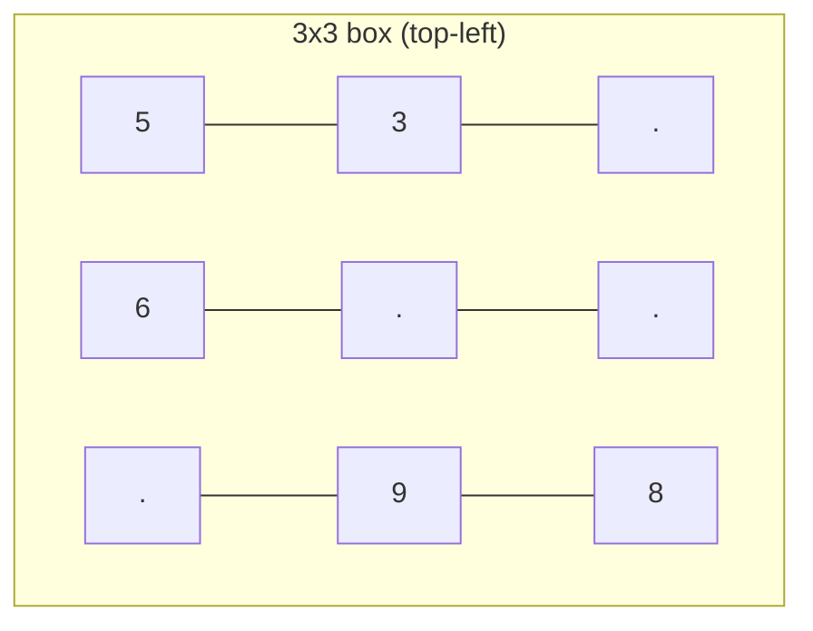

# 36. Valid Sudoku

**Difficulty:** Medium
**Category:** Array, Hash Table, Matrix

## Problem

Determine if a `9 x 9` Sudoku board is valid. Only the filled cells need to be validated according to these rules:

1. Each row must contain the digits `1-9` without repetition.
2. Each column must contain the digits `1-9` without repetition.
3. Each of the nine `3 x 3` sub-boxes must contain the digits `1-9` without repetition.

Note that a Sudoku board (partially filled) could be valid but not necessarily solvable.

### Example 1

```
Input: board =
[["5","3",".",".","7",".",".",".","."]
,["6",".",".","1","9","5",".",".","."]
,[".","9","8",".",".",".",".","6","."]
,["8",".",".",".","6",".",".",".","3"]
,["4",".",".","8",".","3",".",".","1"]
,["7",".",".",".","2",".",".",".","6"]
,[".","6",".",".",".",".","2","8","."]
,[".",".",".","4","1","9",".",".","5"]
,[".",".",".",".","8",".",".","7","9"]]
Output: true
```



### Example 2

```
Input: board with a duplicate "8" in the top-left 3x3 sub-box
Output: false
```

### Constraints

- `board.length == 9`
- `board[i].length == 9`
- `board[i][j]` is a digit `1-9` or `'.'`.

## Approach

Make a single pass over the board, tracking three sets of "seen" digits per row, per column, and per `3 x 3` box (`boxIndex = (row / 3) * 3 + col / 3`). If any digit is already present in its row, column, or box set, the board is invalid.

## C# Solution

```csharp
public class Solution
{
    public bool IsValidSudoku(char[][] board)
    {
        var rows = new HashSet<char>[9];
        var cols = new HashSet<char>[9];
        var boxes = new HashSet<char>[9];

        for (int i = 0; i < 9; i++)
        {
            rows[i] = new HashSet<char>();
            cols[i] = new HashSet<char>();
            boxes[i] = new HashSet<char>();
        }

        for (int row = 0; row < 9; row++)
        {
            for (int col = 0; col < 9; col++)
            {
                char c = board[row][col];
                if (c == '.') continue;

                int boxIndex = (row / 3) * 3 + col / 3;

                if (!rows[row].Add(c) || !cols[col].Add(c) || !boxes[boxIndex].Add(c))
                {
                    return false;
                }
            }
        }

        return true;
    }
}
```

## Complexity

- **Time:** `O(1)` — the board is always `9 x 9`, so this is really `O(81)`.
- **Space:** `O(1)` — bounded set sizes.
