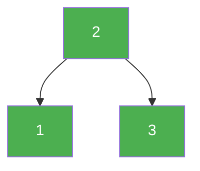

# 98. Validate Binary Search Tree

**Difficulty:** Medium
**Category:** Tree, Depth-First Search, Binary Search Tree, Binary Tree

## Problem

Given the `root` of a binary tree, determine if it is a valid binary search tree (BST). A valid BST has every node's left subtree containing only values less than the node's value, and every node's right subtree containing only values greater than the node's value — and both subtrees must also be valid BSTs.

### Example 1

```
Input: root = [2,1,3]
Output: true
```



### Example 2

```
Input: root = [5,1,4,null,null,3,6]
Output: false
Explanation: The root node's value is 5 but its right child's value is 4.
```

### Constraints

- The number of nodes in the tree is in the range `[1, 10^4]`.
- `-2^31 <= Node.val <= 2^31 - 1`

## Approach

A common mistake is only comparing each node to its immediate children — that misses cases like a right-grandchild being smaller than the root. Instead, recursively pass down a valid `(low, high)` range for each node's value: the root has range `(-inf, +inf)`, the left child inherits `(low, node.val)`, and the right child inherits `(node.val, high)`.

## C# Solution

```csharp
public class Solution
{
    public bool IsValidBST(TreeNode root)
    {
        return Validate(root, long.MinValue, long.MaxValue);
    }

    private bool Validate(TreeNode node, long low, long high)
    {
        if (node == null) return true;

        if (node.val <= low || node.val >= high) return false;

        return Validate(node.left, low, node.val) && Validate(node.right, node.val, high);
    }
}
```

## Complexity

- **Time:** `O(n)` — every node is visited once.
- **Space:** `O(h)` — recursion depth equal to the tree height.
