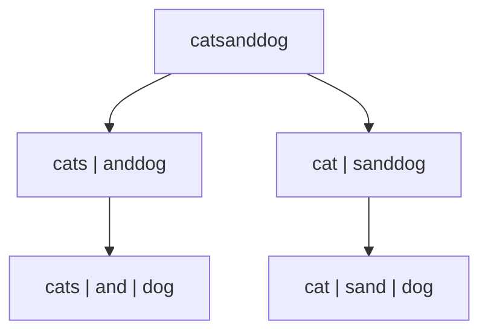

# 140. Word Break II

**Difficulty:** Hard
**Category:** Array, Hash Table, String, Dynamic Programming, Backtracking, Trie, Memoization

## Problem

Given a string `s` and a dictionary of strings `wordDict`, return all possible sentences where `s` is segmented into a space-separated sequence of one or more dictionary words. Return the answer in any order.

### Example 1

```
Input: s = "catsanddog", wordDict = ["cat","cats","and","sand","dog"]
Output: ["cats and dog","cat sand dog"]
```



### Example 2

```
Input: s = "pineapplepenapple", wordDict = ["apple","pen","applepen","pine","pineapple"]
Output: ["pine apple pen apple","pineapple pen apple","pine applepen apple"]
```

### Constraints

- `1 <= s.length <= 20`
- `1 <= wordDict.length <= 1000`
- `1 <= wordDict[i].length <= 10`

## Approach

Use memoized recursion keyed by starting index: for each starting position, try every dictionary word that matches a prefix of the remaining substring, recursively solve the rest, and combine the matched word with each of the rest's solutions. Memoizing the results per starting index avoids recomputing the same suffix's sentences multiple times.

## C# Solution

```csharp
public class Solution
{
    private readonly Dictionary<int, List<string>> memo = new();
    private HashSet<string> dictionary;
    private string s;

    public IList<string> WordBreak(string s, IList<string> wordDict)
    {
        this.s = s;
        dictionary = new HashSet<string>(wordDict);
        return Solve(0);
    }

    private List<string> Solve(int start)
    {
        if (memo.TryGetValue(start, out var cached)) return cached;

        var result = new List<string>();

        if (start == s.Length)
        {
            result.Add(string.Empty);
            memo[start] = result;
            return result;
        }

        for (int end = start + 1; end <= s.Length; end++)
        {
            string word = s.Substring(start, end - start);
            if (!dictionary.Contains(word)) continue;

            foreach (var suffixSentence in Solve(end))
            {
                string sentence = suffixSentence.Length == 0 ? word : word + " " + suffixSentence;
                result.Add(sentence);
            }
        }

        memo[start] = result;
        return result;
    }
}
```

## Complexity

- **Time:** `O(n * 2^n)` worst case — bounded by the number of valid segmentations, reduced substantially by memoization on overlapping suffixes.
- **Space:** `O(n * 2^n)` worst case — for the memoized sentence lists.
