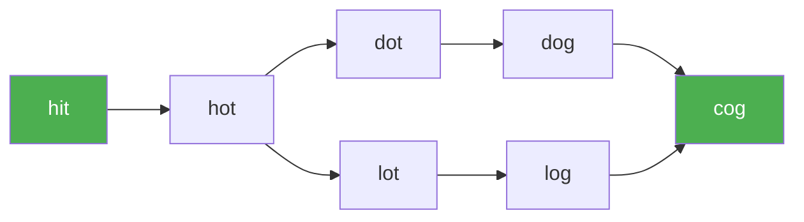

# 126. Word Ladder II

**Difficulty:** Hard
**Category:** Hash Table, String, Breadth-First Search, Backtracking

## Problem

Given two words `beginWord` and `endWord`, and a dictionary `wordList`, return **all** shortest transformation sequences from `beginWord` to `endWord`, where each transformation changes exactly one letter and every intermediate word must exist in `wordList`.

### Example 1

```
Input: beginWord = "hit", endWord = "cog", wordList = ["hot","dot","dog","lot","log","cog"]
Output: [["hit","hot","dot","dog","cog"],["hit","hot","lot","log","cog"]]
```



### Example 2

```
Input: beginWord = "hit", endWord = "cog", wordList = ["hot","dot","dog","lot","log"]
Output: []
Explanation: "cog" is not in wordList, so there's no valid transformation.
```

### Constraints

- `1 <= beginWord.length <= 5`
- `endWord.length == beginWord.length`
- `1 <= wordList.length <= 1000`
- All words consist of lowercase English letters.

## Approach

First run a level-by-level BFS from `beginWord`, recording for every word the set of predecessor words that reach it at the shortest possible distance (this naturally stops extending a word's parents once it has already been reached at an earlier level). Then backtrack from `endWord` through the recorded parent map to reconstruct every shortest path.

## C# Solution

```csharp
public class Solution
{
    public IList<IList<string>> FindLadders(string beginWord, string endWord, IList<string> wordList)
    {
        var result = new List<IList<string>>();
        var dictionary = new HashSet<string>(wordList);
        if (!dictionary.Contains(endWord)) return result;

        var parents = new Dictionary<string, List<string>>();
        var currentLevel = new HashSet<string> { beginWord };
        bool found = false;

        while (currentLevel.Count > 0 && !found)
        {
            foreach (var word in currentLevel) dictionary.Remove(word);
            var nextLevel = new HashSet<string>();

            foreach (var word in currentLevel)
            {
                var chars = word.ToCharArray();

                for (int i = 0; i < chars.Length; i++)
                {
                    char original = chars[i];

                    for (char c = 'a'; c <= 'z'; c++)
                    {
                        if (c == original) continue;
                        chars[i] = c;
                        string candidate = new string(chars);

                        if (dictionary.Contains(candidate))
                        {
                            nextLevel.Add(candidate);

                            if (!parents.TryGetValue(candidate, out var list))
                            {
                                list = new List<string>();
                                parents[candidate] = list;
                            }
                            list.Add(word);

                            if (candidate == endWord) found = true;
                        }
                    }

                    chars[i] = original;
                }
            }

            currentLevel = nextLevel;
        }

        if (found)
        {
            var path = new List<string> { endWord };
            Backtrack(endWord, beginWord, parents, path, result);
        }

        return result;
    }

    private void Backtrack(string word, string beginWord, Dictionary<string, List<string>> parents,
        List<string> path, List<IList<string>> result)
    {
        if (word == beginWord)
        {
            var reversed = new List<string>(path);
            reversed.Reverse();
            result.Add(reversed);
            return;
        }

        if (!parents.TryGetValue(word, out var predecessors)) return;

        foreach (var predecessor in predecessors)
        {
            path.Add(predecessor);
            Backtrack(predecessor, beginWord, parents, path, result);
            path.RemoveAt(path.Count - 1);
        }
    }
}
```

## Complexity

- **Time:** `O(N * L^2 * 26)` for the BFS layer construction (`N` words of length `L`), plus the cost of backtracking out all paths.
- **Space:** `O(N * L)` — for the dictionary, parent map, and per-path buffers.
