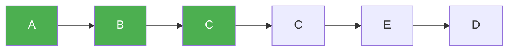

# 79. Word Search

**Difficulty:** Medium
**Category:** Array, Backtracking, Matrix

## Problem

Given an `m x n` grid of characters `board` and a string `word`, return `true` if `word` exists in the grid. The word can be constructed from letters of sequentially adjacent cells (horizontally or vertically neighboring), where the same cell may not be used more than once.

### Example 1

```
Input: board = [["A","B","C","E"],["S","F","C","S"],["A","D","E","E"]], word = "ABCCED"
Output: true
```



### Example 2

```
Input: board = [["A","B","C","E"],["S","F","C","S"],["A","D","E","E"]], word = "SEE"
Output: true
```

### Constraints

- `m == board.length`
- `n == board[i].length`
- `1 <= m, n <= 6`
- `1 <= word.length <= 15`
- `board` and `word` consist of only lowercase and uppercase English letters.

## Approach

DFS/backtrack from every cell that matches `word[0]`. At each step, temporarily mark the current cell as visited (e.g. overwrite it with a sentinel character), recurse into the four neighbors looking for the next character, and restore the cell afterward (backtrack) regardless of the outcome.

## C# Solution

```csharp
public class Solution
{
    public bool Exist(char[][] board, string word)
    {
        int rows = board.Length, cols = board[0].Length;

        for (int row = 0; row < rows; row++)
        {
            for (int col = 0; col < cols; col++)
            {
                if (Dfs(board, word, row, col, 0)) return true;
            }
        }

        return false;
    }

    private bool Dfs(char[][] board, string word, int row, int col, int index)
    {
        if (index == word.Length) return true;

        if (row < 0 || row >= board.Length || col < 0 || col >= board[0].Length
            || board[row][col] != word[index])
        {
            return false;
        }

        char temp = board[row][col];
        board[row][col] = '#'; // mark as visited

        bool found = Dfs(board, word, row + 1, col, index + 1)
            || Dfs(board, word, row - 1, col, index + 1)
            || Dfs(board, word, row, col + 1, index + 1)
            || Dfs(board, word, row, col - 1, index + 1);

        board[row][col] = temp; // backtrack
        return found;
    }
}
```

## Complexity

- **Time:** `O(m * n * 4^L)` — where `L` is `word.Length`; each starting cell can branch into up to 4 directions per character.
- **Space:** `O(L)` — recursion depth.
