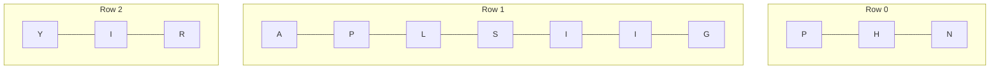

# 6. Zigzag Conversion

**Difficulty:** Medium
**Category:** String

## Problem

The string `"PAYPALISHIRING"` is written in a zigzag pattern on a given number of rows like this (for `numRows = 3`):

```
P   A   H   N
A P L S I I G
Y   I   R
```

Then read line by line: `"PAHNAPLSIIGYIR"`.

Write the code that takes a string and makes this conversion given a number of rows.

### Example 1

```
Input: s = "PAYPALISHIRING", numRows = 3
Output: "PAHNAPLSIIGYIR"
```



### Example 2

```
Input: s = "PAYPALISHIRING", numRows = 4
Output: "PINALSIGYAHRPI"
```

### Example 3

```
Input: s = "A", numRows = 1
Output: "A"
```

### Constraints

- `1 <= s.length <= 1000`
- `s` consists of English letters (lower-case and upper-case), `','` and `'.'`.
- `1 <= numRows <= 1000`

## Approach

Simulate the zigzag by maintaining one `StringBuilder` per row. Walk the string once, appending each character to the current row, and flip the direction (down/up) whenever the top or bottom row is hit. Concatenate all rows at the end.

## C# Solution

```csharp
public class Solution
{
    public string Convert(string s, int numRows)
    {
        if (numRows == 1 || numRows >= s.Length) return s;

        var rows = new StringBuilder[numRows];
        for (int i = 0; i < numRows; i++) rows[i] = new StringBuilder();

        int curRow = 0;
        bool goingDown = false;

        foreach (char c in s)
        {
            rows[curRow].Append(c);
            if (curRow == 0 || curRow == numRows - 1) goingDown = !goingDown;
            curRow += goingDown ? 1 : -1;
        }

        var result = new StringBuilder();
        foreach (var row in rows) result.Append(row);
        return result.ToString();
    }
}
```

## Complexity

- **Time:** `O(n)` — every character is processed once.
- **Space:** `O(n)` — for the row buffers and the result.
