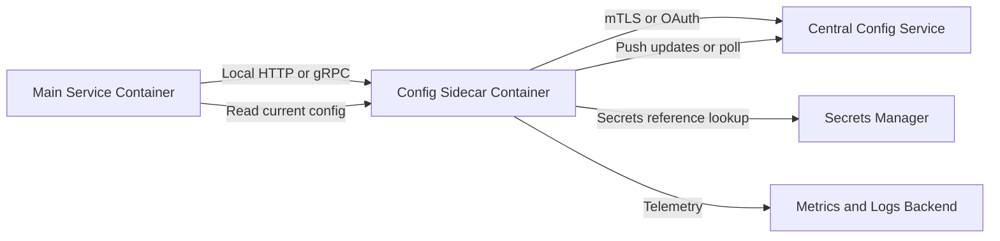
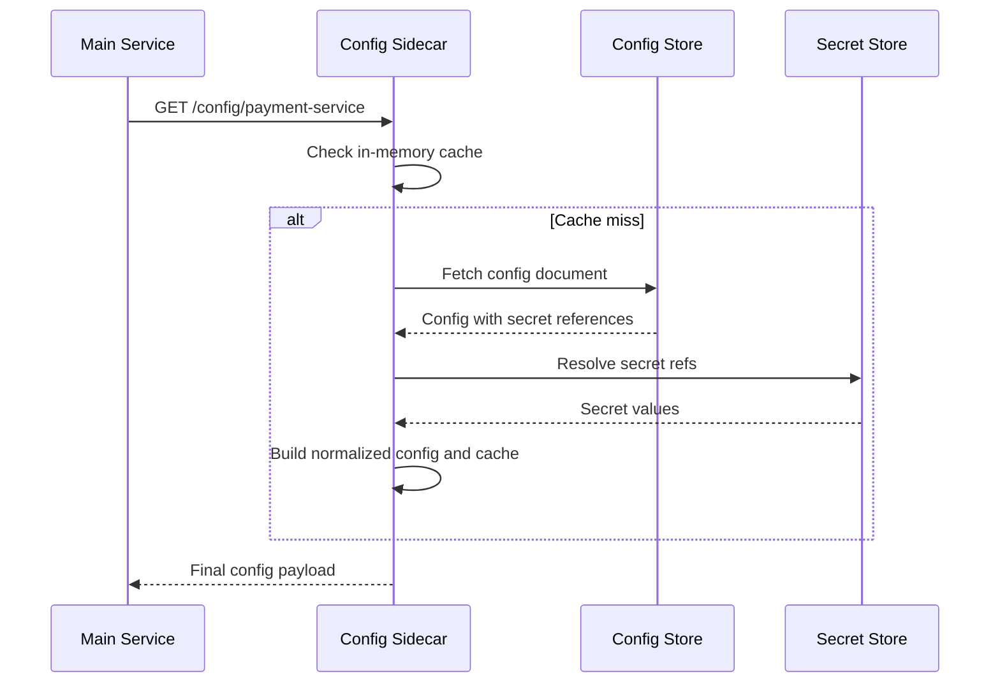
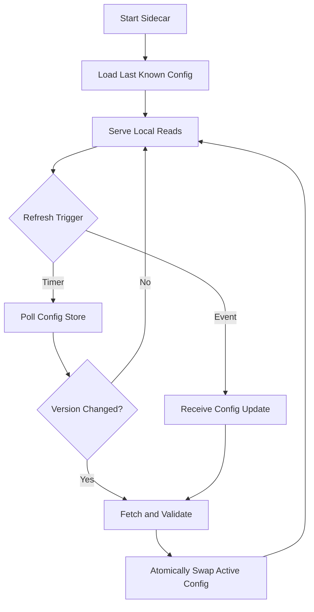
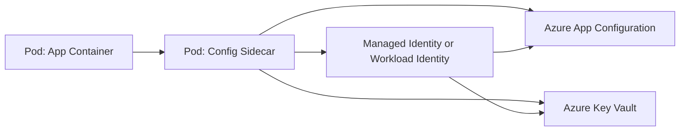

# How Sidecar Pattern Is Used to Access App Config Values in Depth

This topic explains how the Sidecar Pattern helps microservices fetch, cache, secure, and refresh application configuration without pushing that complexity into every service.

## Why Sidecar for Config Access

In microservices, every service needs configuration such as:

- feature flags
- endpoint URLs
- retry policies
- secrets references
- tenant-specific settings

If each service directly implements config fetch logic, you get:

- duplicated code
- inconsistent caching and retries
- repeated security mistakes
- harder runtime debugging

A sidecar centralizes this responsibility next to the app process.

## Core Sidecar Idea

A sidecar is a companion process/container deployed with the main service instance.

- Main app focuses on business logic.
- Sidecar handles config retrieval, auth, caching, refresh, and fallback.

The app talks locally to the sidecar over localhost or a shared volume.

## Architecture Diagram

## Request Flow for a Config Read

## Refresh and Change Propagation

There are two common refresh strategies.

### Pull Model

- sidecar polls config store every N seconds
- applies version checks (etag, generation, checksum)
- updates cache if changed

### Push Model

- sidecar subscribes to change events
- receives updates from config platform
- updates cache immediately

## Refresh Lifecycle Diagram

## Config Safety Patterns

### 1. Atomic Config Swap

Do not partially mutate live config objects.

- build new config snapshot
- validate schema and constraints
- replace active pointer atomically

This avoids mixed old/new values during updates.

### 2. Last Known Good Fallback

When upstream config service is down:

- keep serving cached validated config
- expose staleness metrics
- alert on max staleness threshold

### 3. Validation Gate

Sidecar should reject invalid config before exposing it.

Validation examples:

- required fields present
- numeric bounds valid
- URL formats valid
- feature dependencies consistent

## Security Architecture

Sidecar can improve security posture by:

- owning credentials needed for config/secrets backend
- reducing secret exposure in app process
- rotating tokens independently
- enforcing least-privilege policy for config read scopes

In Kubernetes, this often pairs with workload identity so sidecar obtains tokens without static secrets.

## Azure-Oriented Deployment Picture

## Operational Metrics You Should Track

- config fetch latency
- cache hit ratio
- refresh success and failure counts
- age of active config snapshot
- number of rejected config versions
- secret resolution latency

These metrics help detect stale config and broken rollout behavior early.

## Failure Scenarios and Behavior

### Config Store Unavailable

Expected sidecar behavior:

- serve last known good snapshot
- backoff and retry upstream calls
- emit warning and freshness metrics

### Bad Config Pushed

Expected sidecar behavior:

- fail validation
- reject new version
- retain previous active snapshot
- emit validation error diagnostics

### Secret Backend Throttling

Expected sidecar behavior:

- use resolved secret cache if still valid
- throttle retries
- protect app from cascading failures

## Real-World Example

A checkout microservice requires:

- tax feature flags
- payment endpoint map by region
- fraud threshold values
- certificate reference for external API calls

Using sidecar:

- service calls local sidecar endpoint
- sidecar fetches config from central store
- sidecar resolves secrets via vault
- sidecar caches and refreshes values safely

Result:

- app code stays lean
- config behavior is consistent across services
- rollout and rollback become operationally safer

## Common Mistakes

- letting app bypass sidecar for some config paths
- no schema validation before publishing to app
- no staleness limits for fallback mode
- sharing one oversized global config payload for all services

## Summary

Sidecar Pattern for config access gives strong separation of concerns.

The sidecar becomes a local configuration control plane for each service instance, handling retrieval, security, validation, caching, and refresh while the application focuses on business logic.
