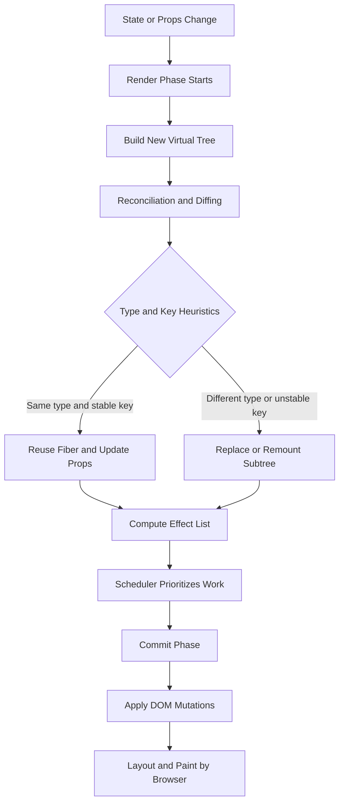

# React Diffing Algorithm in Detail

React diffing is the process React uses to compare a previous UI tree with a new UI tree and determine the minimum set of DOM updates needed.

This is a core reason React can keep UI updates efficient.

## Why React Needs Diffing

Directly rebuilding the full DOM on every state change would be expensive.

React instead:

1. Builds a new virtual representation of the UI.
2. Compares it against the previous one.
3. Applies only required changes to the real DOM.

## Architecture Diagram

## Core Heuristics React Uses

React does not do a full optimal tree-edit algorithm because that would be too slow for large trees.

Instead it relies on practical heuristics:

- Elements of different types produce different subtrees.
- Developers provide stable keys for list items.

With these assumptions, reconciliation is near linear for common cases.

## How Reconciliation Works

### 1. Compare Root Element Type

If root types differ, React tears down old subtree and mounts new subtree.

Example:

- previous: div
- next: section

React replaces that branch entirely.

### 2. Same DOM Element Type

If types are same (for example div to div), React keeps the node and updates changed attributes/styles.

Example updates:

- className changes
- inline style changes
- event handler reference changes

### 3. Same Component Type

If component type is unchanged, React reuses component instance logic and runs render again with new props/state.

Then it diffs returned child trees recursively.

### 4. Children Diffing

For children arrays, React walks old and new lists.

Without keys, position-based matching is used, which can cause extra moves/remounts.

With stable keys, React can map identity across reorders and perform smaller updates.

## Role of Keys

Keys are identity hints for siblings in a list.

Good keys:

- unique among siblings
- stable across renders
- based on real data identity (for example database id)

Bad keys:

- array index in re-orderable lists
- random value generated on each render

Bad keys can cause:

- unnecessary remounts
- lost input focus
- local component state jumping rows

## Fiber and Scheduling Context

Modern React implements reconciliation on the Fiber architecture.

Fiber enables React to:

- split rendering work into units
- pause and resume work
- prioritize urgent updates over non-urgent ones

Important distinction:

- Render phase computes what should change.
- Commit phase applies actual DOM mutations.

Diffing happens during render/reconciliation.

## Example: List Reorder

Suppose old list is:

- A
- B
- C

New list is:

- C
- A
- B

If keys are stable ids, React recognizes item identity and reorders efficiently.

If keys are indexes, React may interpret many items as changed content and perform more costly updates.

## Complexity Perspective

Ideal tree-diff is expensive in general.

React trades theoretical optimality for practical performance with assumptions about type and key stability.

That tradeoff makes updates fast in real applications when components are designed correctly.

## Performance Implications for Developers

You influence diffing cost by:

- using stable keys
- avoiding unnecessary parent re-renders
- memoizing expensive subtrees where appropriate
- keeping component structure predictable

Related tools:

- React.memo
- useMemo
- useCallback
- Profiler in React DevTools

## Common Misconceptions

- React does not compare full HTML strings.
- Virtual DOM is not free; creating trees and diffing has cost.
- Keys are not just warning suppressors; they affect correctness and performance.

## Real-World Scenario

In a trading dashboard with rapidly updating rows:

- using stable instrument ids as keys keeps row components tied to correct state
- using index keys can lead to flicker, wrong row state reuse, and extra renders

## Summary

React diffing algorithm is a heuristic reconciliation strategy that compares old and new virtual trees and updates only what changed.

Its efficiency depends heavily on element type stability and correct key usage, especially in dynamic lists.
