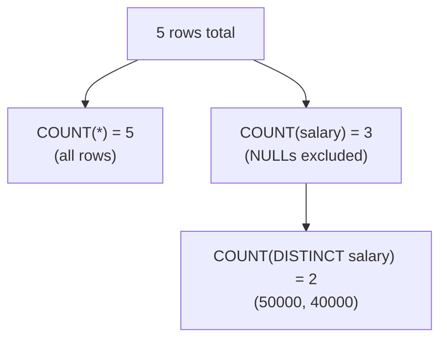

# COUNT() Function: NULLs, DISTINCT, and Common Pitfalls

`COUNT()` behaves differently depending on what you pass it — `COUNT(*)`, `COUNT(column)`, and `COUNT(DISTINCT column)` are not interchangeable, and NULLs are the reason why.

## Example

### Input: `employees`

| id | name | salary |
|---|---|---|
| 1 | Ramu | 50000 |
| 2 | Sita | 40000 |
| 3 | Karthik | NULL |
| 4 | Pratheek | 40000 |
| 5 | Bhaskar | NULL |

### Queries and Results

```sql
SELECT COUNT(*) FROM employees;                    -- 5
SELECT COUNT(1) FROM employees;                     -- 5
SELECT COUNT(-1) FROM employees;                    -- 5
SELECT COUNT(salary) FROM employees;                -- 3
SELECT COUNT(DISTINCT salary) FROM employees;       -- 2
```

## Why Each One Returns What It Does

| Expression | Counts | Result | Why |
|---|---|---|---|
| `COUNT(*)` | Every row | 5 | Counts rows regardless of NULLs in any column |
| `COUNT(1)` / `COUNT(-1)` | Every row | 5 | Any constant expression behaves like `COUNT(*)` — the literal value is never NULL, so every row qualifies |
| `COUNT(salary)` | Non-NULL `salary` values | 3 | `COUNT(column)` skips rows where that column is NULL (Karthik and Bhaskar excluded) |
| `COUNT(DISTINCT salary)` | Unique non-NULL `salary` values | 2 | Only `50000` and `40000` remain after removing NULLs and duplicates |



## Common Mistake

Assuming `COUNT(column)` and `COUNT(*)` always return the same number. They only match when the column has no NULLs. Always use `COUNT(*)` when you want a plain row count, and `COUNT(column)` only when you specifically want to count non-NULL values in that column.

## Summary

`COUNT(*)`/`COUNT(constant)` count rows unconditionally; `COUNT(column)` counts only non-NULL values in that column; `COUNT(DISTINCT column)` counts unique non-NULL values. Knowing this distinction explains results that otherwise look inconsistent when a table contains NULLs.
