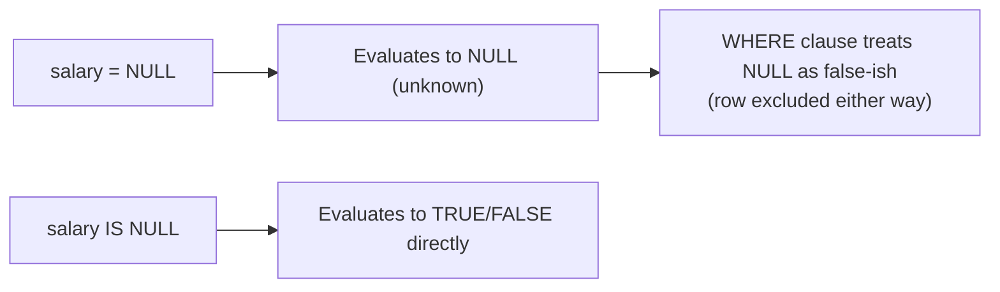

# NULL Handling in Practice: IS NULL, GROUP BY, NULLIF vs COALESCE

NULL represents "unknown," not a value — and that single fact explains a whole category of SQL surprises: why `NULL = NULL` isn't true, how `GROUP BY` treats NULLs, and when to reach for `NULLIF` versus `COALESCE`.

## Why `NULL = NULL` Is Not TRUE

```sql
SELECT * FROM employees WHERE NULL = NULL; -- returns zero rows
```

- Comparing NULL to anything with `=`, `<>`, `<`, `>` produces NULL (unknown), not TRUE — so a `WHERE` clause built on that comparison filters the row out, since `WHERE` only keeps rows where the condition evaluates to TRUE.
- To check for NULL, use the dedicated operator:

```sql
SELECT * FROM employees WHERE salary IS NULL;  -- correct way to find NULL rows
SELECT * FROM employees WHERE salary IS NOT NULL;
```



## How GROUP BY Treats NULL

```sql
-- Employees table
-- Department | EmployeeName
-- Sales      | Alice
-- Sales      | Bob
-- NULL       | Charlie
-- NULL       | David

SELECT Department, COUNT(*)
FROM Employees
GROUP BY Department;
```

| Department | COUNT(*) |
|---|---|
| Sales | 2 |
| NULL | 2 |

- `GROUP BY` treats all NULLs as **one single group** — they are not excluded or ignored, unlike in most aggregate function arguments.
- To label that group meaningfully instead of showing a bare NULL:

```sql
SELECT COALESCE(Department, 'Unknown') AS Dept, COUNT(*)
FROM Employees
GROUP BY COALESCE(Department, 'Unknown');
```

## NULLIF vs COALESCE

| Function | Behavior | Typical Use |
|---|---|---|
| `NULLIF(a, b)` | Returns NULL if `a = b`, otherwise returns `a` | Convert a specific "sentinel" value into NULL |
| `COALESCE(a, b, ..., n)` | Returns the first non-NULL argument | Replace NULL with a fallback/default value |

### Example

| id | name | salary |
|---|---|---|
| 1 | Ramu | 50000 |
| 2 | Sita | 40000 |
| 3 | Karthik | NULL |
| 4 | Pratheek | 40000 |
| 5 | Bhaskar | NULL |

```sql
SELECT
    name,
    NULLIF(salary, 40000) AS salary_nullif,
    COALESCE(salary, 30000) AS salary_coalesce
FROM employees;
```

| name | salary_nullif | salary_coalesce |
|---|---|---|
| Ramu | 50000 | 50000 |
| Sita | NULL | 40000 |
| Karthik | NULL | 30000 |
| Pratheek | NULL | 40000 |
| Bhaskar | NULL | 30000 |

- `NULLIF(salary, 40000)` turns every `40000` into NULL (useful for treating a "placeholder" value like `0` or `-1` as effectively missing).
- `COALESCE(salary, 30000)` fills in `30000` wherever `salary` was already NULL — it does **not** interact with `NULLIF` in the same expression; each column is computed independently from the original `salary` value.

## Aggregates and NULL

```sql
SELECT SUM(salary) AS total, AVG(salary) AS average FROM employees;
```

- `SUM`/`AVG` **ignore** NULLs — they don't treat them as zero. `SUM(salary)` here is `50000 + 40000 + 40000 = 130000` (not divided by 5 rows for the average, but by 3 non-NULL rows).
- If **every** value being aggregated is NULL, `SUM`/`AVG` return NULL (there's nothing to sum/average), not `0`.

## Summary

NULL is "unknown," so equality comparisons involving NULL never return TRUE — use `IS NULL`/`IS NOT NULL` instead. `GROUP BY` groups NULLs together as their own bucket rather than discarding them. `NULLIF` converts a matching value into NULL; `COALESCE` replaces NULL with a fallback. Aggregate functions silently skip NULLs rather than treating them as zero, only returning NULL themselves when there's no non-NULL data at all.
