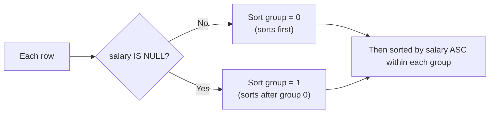

# ORDER BY and NULL Sorting Behavior

NULL doesn't behave like a normal value when sorting — where it lands in ascending vs descending order depends on the database engine, and controlling that placement explicitly is a common practical requirement.

## Example

### Input: `employees`

| id | name | salary |
|---|---|---|
| 1 | Ramu | 50000 |
| 2 | Sita | 40000 |
| 3 | Karthik | NULL |
| 4 | Pratheek | 40000 |
| 5 | Bhaskar | NULL |

## Default Ascending Order

```sql
SELECT name, salary FROM employees ORDER BY salary;
```

| name | salary |
|---|---|
| Karthik | NULL |
| Bhaskar | NULL |
| Pratheek | 40000 |
| Sita | 40000 |
| Ramu | 50000 |

- In SQL Server/most engines, NULLs sort **first** in ascending order by default.

## Default Descending Order

```sql
SELECT name, salary FROM employees ORDER BY salary DESC;
```

| name | salary |
|---|---|
| Ramu | 50000 |
| Sita | 40000 |
| Pratheek | 40000 |
| Bhaskar | NULL |
| Karthik | NULL |

- Reversing the sort simply reverses NULLs to the **end** — they aren't treated as "smallest" or "largest," just placed consistently at one end.

## Forcing NULLs to Sort Last (Regardless of Direction)

```sql
SELECT name, salary
FROM employees
ORDER BY
    CASE WHEN salary IS NULL THEN 1 ELSE 0 END,
    salary ASC;
```

| name | salary |
|---|---|
| Sita | 40000 |
| Pratheek | 40000 |
| Ramu | 50000 |
| Bhaskar | NULL |
| Karthik | NULL |

## How the CASE Trick Works



- The `CASE` expression creates an artificial first sort key: 0 for non-NULL rows, 1 for NULL rows. Because `ORDER BY` evaluates keys left to right, all `0`-group rows sort before all `1`-group rows, and the second key (`salary`) only breaks ties within each group.
- Some databases (PostgreSQL, Oracle) support `ORDER BY salary NULLS LAST` directly — the `CASE` pattern is the portable equivalent that works across most engines, including SQL Server.

## Common Mistake

Assuming NULL sorting behavior is guaranteed identical across all database engines — it isn't part of the SQL standard's required behavior, so always verify (or explicitly control it with `CASE`/`NULLS LAST`) rather than relying on default behavior for business-critical ordering (e.g., showing incomplete records last on a dashboard).

## Summary

By default, NULLs sort to one end of the result set (typically first in ascending order), and simply reversing the sort direction moves them to the other end rather than genuinely repositioning them relative to real values. To explicitly control NULL placement regardless of sort direction, add a `CASE WHEN column IS NULL THEN 1 ELSE 0 END` as the primary sort key (or use `NULLS LAST`/`NULLS FIRST` where supported).
