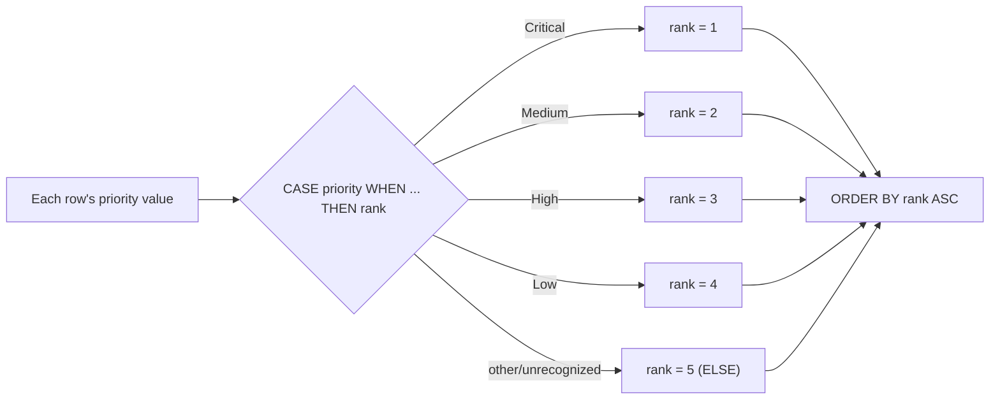

# Order Tasks by a Custom Priority Sequence

Sorting alphabetically doesn't work when your priority labels aren't alphabetically meaningful (`Critical` should outrank `High`, but `C` doesn't come before `H` in the order you want). A `CASE` expression inside `ORDER BY` lets you define exactly the sequence you need.

## Example

### Input: `tasks`

| id | name | priority | assignee |
|---|---|---|---|
| 1 | Fix Payment | Critical | Prabhakar |
| 2 | Update Onboarding | Medium | Saswat |
| 3 | Server Downtime | Critical | Dhanush |
| 4 | Redesign UI | Low | Prabhakar |
| 5 | Fix login timeout | High | Saswat |
| 6 | Optimise Search | High | Dhanush |
| 7 | Add Dark Mode | Low | Dhanush |
| 9 | Write Unit Tests | Medium | Prabhakar |

### Expected Output (Critical → Medium → High → Low, per business rule)

| id | name | priority | assignee |
|---|---|---|---|
| 1 | Fix Payment | Critical | Prabhakar |
| 3 | Server Downtime | Critical | Dhanush |
| 2 | Update Onboarding | Medium | Saswat |
| 9 | Write Unit Tests | Medium | Prabhakar |
| 5 | Fix login timeout | High | Saswat |
| 6 | Optimise Search | High | Dhanush |
| 7 | Add Dark Mode | Low | Dhanush |
| 4 | Redesign UI | Low | Prabhakar |

*(Note: this particular business rule ranks Medium above High — a good reminder that "priority order" is whatever the business defines, not necessarily what seems intuitive.)*

## Solution

```sql
SELECT *
FROM tasks
ORDER BY
    CASE priority
        WHEN 'Critical' THEN 1
        WHEN 'Medium'   THEN 2
        WHEN 'High'     THEN 3
        WHEN 'Low'      THEN 4
        ELSE 5
    END ASC;
```

## How It Works



- The `CASE` expression maps each text label to a numeric rank matching the desired sequence.
- `ORDER BY` then sorts by that computed rank instead of the raw text value — completely decoupling display order from alphabetical/lexical order.
- The `ELSE 5` clause is important: it gives any unexpected/unmapped priority value a defined (last) position instead of unpredictable behavior.

## Extending With a Secondary Sort

```sql
SELECT *
FROM tasks
ORDER BY
    CASE priority
        WHEN 'Critical' THEN 1
        WHEN 'Medium'   THEN 2
        WHEN 'High'     THEN 3
        WHEN 'Low'      THEN 4
        ELSE 5
    END ASC,
    id ASC; -- tie-breaker within the same priority rank
```

## Common Mistake

Forgetting the `ELSE` branch — without it, any priority value not explicitly listed evaluates to NULL, and depending on the engine's NULL-sorting rules (see the ORDER BY/NULL topic), those rows could unexpectedly sort first or last rather than predictably at the end.

## Real-World Example

A project management dashboard shows tasks ranked by business urgency rather than alphabetical priority name — critical incidents always at the top regardless of whether "Critical" or "High" comes first alphabetically — using exactly this `CASE`-in-`ORDER BY` pattern, with the mapping defined once as a lookup table or inline CASE expression.

## Summary

To sort by a custom, non-alphabetical sequence, map each category to a numeric rank with a `CASE` expression inside `ORDER BY`. This decouples sort order from the literal text value entirely, and an `ELSE` branch ensures unexpected values still get a predictable, defined position instead of relying on the database's default NULL-sorting behavior.
