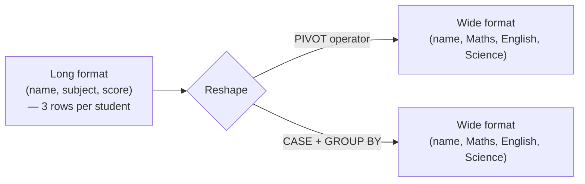

# Subject-Wise Scores: PIVOT vs Conditional Aggregation

Turning "long" data (one row per name+subject+score) into "wide" data (one row per name, one column per subject) is a common reporting need. SQL Server's `PIVOT` operator does this directly, but the same result can be achieved portably with conditional aggregation.

## Example

### Input: `scores`

| name | subject | score |
|---|---|---|
| Ram | English | 80 |
| Ram | Maths | 90 |
| Ram | Science | 89 |
| Priyal | English | 98 |
| Priyal | Maths | 67 |
| Priyal | Science | 88 |
| Karthik | Maths | 99 |
| Karthik | English | 87 |
| Karthik | Science | 96 |

### Expected Output

| name | maths | english | science |
|---|---|---|---|
| Karthik | 99 | 87 | 96 |
| Priyal | 67 | 98 | 88 |
| Ram | 90 | 80 | 89 |

## Solution 1 — Using PIVOT (SQL Server / supported engines)

```sql
SELECT name, [Maths], [English], [Science]
FROM scores
PIVOT (
    MAX(score)
    FOR subject IN ([Maths], [English], [Science])
) AS pivot_table;
```

- `PIVOT` groups by every column *not* mentioned in the pivot clause (here, `name`), then spreads the specified `subject` values out into their own columns, applying `MAX(score)` as the aggregation for each (name, subject) cell.
- `MAX` (or any aggregate) is required even if you expect exactly one score per name/subject — `PIVOT` always needs an aggregation function to collapse into a single cell value, in case multiple matching rows exist.

## Solution 2 — Conditional Aggregation (Portable Across Databases)

```sql
SELECT
    name,
    MAX(CASE WHEN subject = 'Maths' THEN score END) AS maths,
    MAX(CASE WHEN subject = 'English' THEN score END) AS english,
    MAX(CASE WHEN subject = 'Science' THEN score END) AS science
FROM scores
GROUP BY name;
```

- Functionally equivalent to the `PIVOT` version, and works on any SQL engine (PostgreSQL, MySQL, SQLite) that doesn't support the `PIVOT` keyword.
- `MAX(CASE WHEN subject = 'Maths' THEN score END)`: for a given `name`, this returns the score where `subject = 'Maths'` and NULL for every other row — `MAX` then picks out that one non-NULL value per group (any aggregate that ignores NULLs works, like `MIN` or `SUM`, since there's normally only one non-NULL candidate per group).



## When to Use Which

| | PIVOT | Conditional Aggregation (CASE) |
|---|---|---|
| Portability | SQL Server, Oracle (syntax varies) | Works everywhere (standard SQL) |
| Readability | Concise once you know the syntax | More verbose but explicit |
| Dynamic columns (subject list unknown ahead of time) | Requires dynamic SQL either way | Requires dynamic SQL either way |

- Both approaches require you to know the column values (`Maths`, `English`, `Science`) at query-writing time — turning a truly dynamic, unknown set of subjects into columns requires building the query string dynamically in either case.

## Common Mistake

Forgetting to wrap the pivoted value in an aggregate function (`MAX`/`MIN`/`SUM`) in the conditional aggregation version — without it, most databases will reject the query since `GROUP BY name` requires every non-grouped column to be wrapped in an aggregate.

## Summary

Converting long-format data into a wide, subject-per-column report can be done with the dedicated `PIVOT` operator (concise, but syntax varies by engine and isn't universally supported) or with conditional aggregation using `MAX(CASE WHEN ...)` grouped by the row-identifying column (more verbose, but portable across virtually every SQL database).
