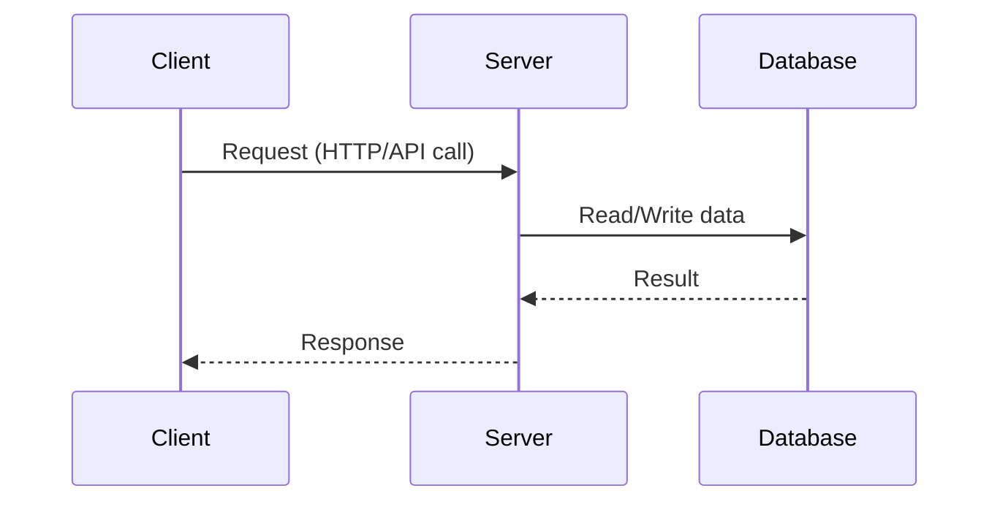
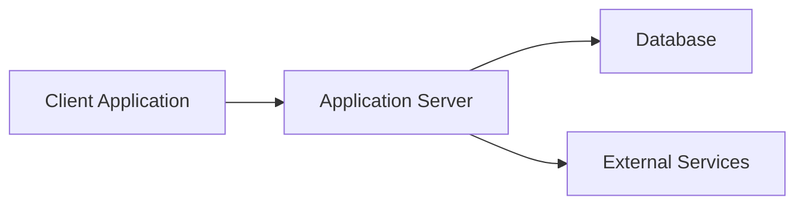

# Client-Server Architecture

Client-server architecture is a foundational system design model where clients request services and servers provide them.

It is one of the most common patterns behind web apps, mobile apps, APIs, and enterprise systems.

## Core Idea

- Client: initiates requests (browser, mobile app, desktop app).
- Server: processes requests and returns responses.

The client handles presentation and user interaction, while the server handles business logic, data access, and security controls.

## Basic Flow

## Main Components

### 1. Client Layer

Examples:

- web UI (React/Angular)
- mobile app
- desktop app

Responsibilities:

- user input
- sending requests
- rendering responses

### 2. Server Layer

Examples:

- REST API service
- backend web server
- microservice endpoint

Responsibilities:

- authentication and authorization
- business rules
- validation
- orchestration of downstream calls

### 3. Data Layer

Examples:

- SQL/NoSQL database
- cache
- file/object storage

Responsibilities:

- persistent storage
- query and transaction support

## 2-Tier vs 3-Tier View

### 2-Tier

Client talks directly to database server in some legacy systems.

### 3-Tier

Client -> Application Server -> Database

This is the modern standard because it improves security, maintainability, and scalability.

## Architecture Diagram

## Advantages

- clear separation of concerns
- central control of business logic
- easier to secure sensitive operations
- supports many clients with one backend
- easier to update backend logic without updating every client

## Challenges

- server can become bottleneck if not scaled
- network latency affects user experience
- requires session/state strategy
- needs load balancing and failover for high availability

## Scalability Patterns

To scale client-server systems:

- add load balancer in front of servers
- scale backend horizontally (multiple instances)
- use caching for frequent reads
- split monolith into services when complexity grows

## Security Considerations

Important controls:

- TLS for encrypted communication
- strong authentication and token validation
- authorization checks on server
- rate limiting and DDoS protection
- input validation against injection attacks

## Real-World Example

Online shopping app:

1. Client requests product list.
2. Server validates request and queries database.
3. Server may read cache for faster response.
4. Response is returned to client.

For checkout:

- client sends order request
- server validates inventory and payment rules
- server writes order and returns status

## When to Use

Use client-server architecture when:

- multiple users need centralized data and logic
- you need controlled security and governance
- you expect growth and future scaling

## Common Mistakes

- putting business logic only on client side
- exposing database directly to clients
- skipping server-side validation
- not planning for scaling and observability

## Summary

Client-server architecture is a simple but powerful foundation for modern systems. Clients request, servers process, and data is managed centrally. With proper layering, security, and scaling, it supports reliable and maintainable applications.
