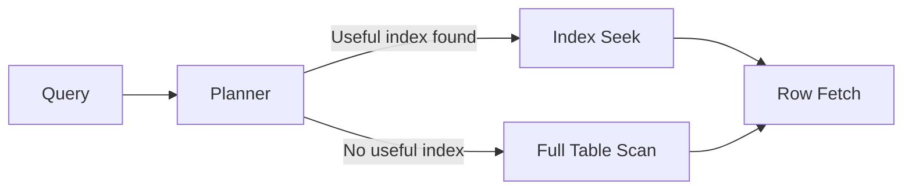

# DB Indexing

DB indexing is a data structure technique used to speed up query performance by reducing the amount of data the database must scan.

In system design, indexing is one of the highest-impact decisions for latency, throughput, and cost. Poor indexing can make a well-designed architecture fail under production load.

## Why Indexing Matters

Without indexes, many queries perform full table scans:

- high I/O cost
- high CPU usage
- poor p95/p99 latency
- degraded performance under concurrency

With proper indexes, the database can find matching rows quickly and read less data.

## Mental Model

Think of an index like a sorted lookup structure that points to data rows.

Instead of searching every row, the engine navigates the index and jumps to matching records.

## Common Index Data Structures

### 1. B-Tree (Most Common)

Used by many relational databases for equality, range, and sort-friendly queries.

Good for:

- WHERE column = value
- WHERE column > value
- ORDER BY column

### 2. Hash Index

Optimized for exact equality lookups.

Good for:

- key = value

Not good for:

- range queries
- ordered scans

### 3. Specialized Indexes

Depending on database:

- Full-text indexes for keyword search
- GIN/GiST-like structures for JSON/array/geospatial cases
- Columnstore indexes for analytics

## Clustered vs Non-Clustered (Conceptual)

### Clustered Index

Defines physical row order (or storage layout equivalent). Typically only one primary clustering order.

### Non-Clustered Index

Separate structure with key plus row locator.

In design interviews, mention that clustered choice impacts range scans and write patterns.

## Primary, Unique, and Secondary Indexes

- Primary key index: enforces identity and fast key lookup
- Unique index: enforces uniqueness on business identifiers (email, username)
- Secondary indexes: improve common access paths

## Single-Column vs Composite Index

### Single-Column

Useful for filters on one attribute.

### Composite (Multi-Column)

Useful for combined predicates and sort order.

Example query pattern:

- WHERE tenant_id = ? AND created_at >= ? ORDER BY created_at DESC

Possible composite index:

- (tenant_id, created_at DESC)

Column order is critical; wrong order can make index underutilized.

## Covering Index

A covering index includes all columns needed for a query, allowing index-only retrieval.

Benefits:

- fewer table lookups
- lower I/O
- faster high-QPS reads

Tradeoff:

- larger index size
- higher write overhead

## Write Penalty of Indexes

Indexes accelerate reads but slow writes.

Every INSERT/UPDATE/DELETE may need index updates.

Too many indexes can cause:

- higher write latency
- increased lock contention
- more storage use
- longer maintenance/rebuild windows

System design must balance read speed with write cost.

## Query Planner Interaction

Database optimizer chooses whether and how to use indexes.

Reasons an index may not be used:

- low selectivity
- stale statistics
- function wrapping indexed column
- mismatched data type/collation
- leading wildcard patterns (for B-tree)

Always think in terms of real query shape and cardinality.

## Selectivity and Cardinality

Indexes are most effective when they significantly reduce candidate rows.

- high-cardinality columns (user_id, order_id): usually strong candidates
- very low-cardinality columns (status with few values): often weak alone

Low-cardinality columns can still help in composite indexes.

## Read Path with and without Index

## Design Workflow for Indexing

1. Identify top read queries by frequency and latency.
2. Group by query pattern (filters, joins, sort, pagination).
3. Add minimal indexes for highest-value paths.
4. Validate with execution plans and load tests.
5. Monitor write cost and storage growth.
6. Remove unused or redundant indexes.

## Indexing in Multi-Tenant Systems

Common pattern:

- put tenant_id first in composite indexes

Why:

- tenant pruning
- better isolation of query paths
- predictable performance under mixed tenant load

## Indexing and Pagination

Offset pagination can degrade at large offsets.

For large datasets, keyset pagination with aligned index is better:

- WHERE (created_at, id) < (?, ?)
- ORDER BY created_at DESC, id DESC

Requires corresponding composite index for stable performance.

## Indexing and Joins

Join columns should usually be indexed on at least one side, often both.

Without join indexes:

- expensive hash/merge behavior
- high temporary memory/disk usage

In system design interviews, mention indexing foreign keys and frequent join predicates.

## Operational Concerns

Index management includes:

- online index creation/rebuild strategy
- fragmentation checks
- statistics refresh
- migration safety for large tables

Observability metrics:

- slow query count
- index hit ratio
- scan vs seek rates
- storage used per index

## Common Mistakes

- adding indexes for every column
- ignoring write amplification
- creating duplicate/redundant indexes
- wrong column order in composite indexes
- no validation with execution plans
- forgetting to drop unused indexes

## Interview Framing (Medium Level)

A strong DB indexing system design answer should cover:

1. workload characterization (read-heavy vs write-heavy)
2. query-pattern-driven index selection
3. composite index ordering logic
4. read latency gains vs write penalties
5. operational lifecycle (monitor, tune, prune)
6. scaling context (partitioning/sharding interactions)

## Indexing and Sharding Relationship

Sharding and indexing solve different problems:

- indexing: speeds queries within a shard/node
- sharding: distributes data/load across nodes

In large systems, both are required:

- good local indexes on each shard
- routing that keeps queries shard-targeted

## Summary

DB indexing is a core performance lever in system design. Correct indexes can reduce query latency dramatically, but every index has write and maintenance cost. The right strategy starts from real query patterns, balances read/write tradeoffs, and evolves through continuous measurement.
