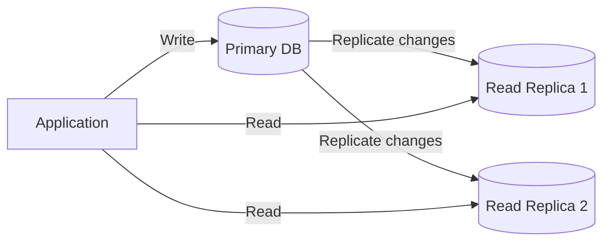
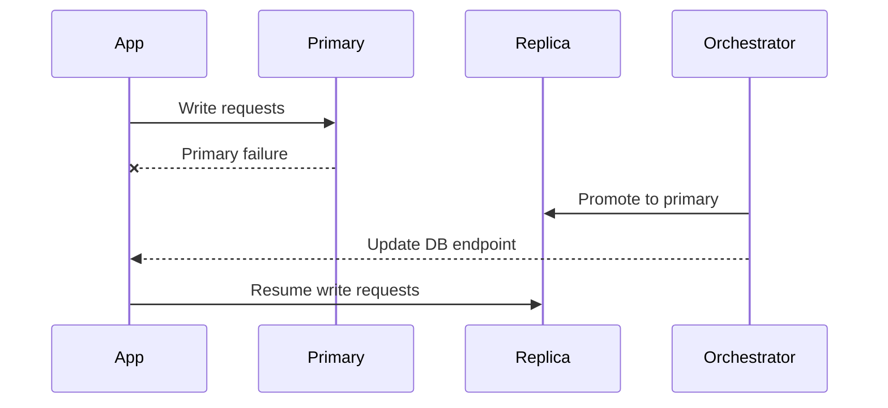

# DB Replication

DB replication is the process of copying data from one database node to one or more other nodes.

In system design, replication is used to improve availability, read scalability, and disaster recovery.

## Why DB Replication Matters

Replication helps solve common production problems:

- primary database overload from heavy reads
- single point of failure risks
- regional latency for global users
- backup and recovery requirements

It is a core concept in reliable distributed data systems.

## Basic Replication Model

The most common design is primary-replica:

- Primary: accepts writes
- Replicas: receive data changes and typically serve reads

## Replication Types

### 1. Synchronous Replication

Primary confirms a write only after replica acknowledgement.

Pros:

- stronger consistency
- lower risk of data loss on failover

Cons:

- higher write latency
- reduced throughput if replica is slow

### 2. Asynchronous Replication

Primary confirms write before replicas catch up.

Pros:

- fast writes
- better write throughput

Cons:

- replication lag
- possible data loss during sudden primary failure

Most web-scale systems use asynchronous replication for performance.

## Replication Lag

Lag is the delay between data written to primary and visible on replicas.

Effects:

- stale reads
- inconsistent user experience

Example:

1. User updates profile.
2. Immediate read routed to replica.
3. Replica has not applied change yet.
4. User sees old profile data.

## Read/Write Routing Strategy

Typical approach:

- all writes -> primary
- most reads -> replicas
- critical read-after-write -> primary

This balances scale and consistency.

## Failover and High Availability

If primary fails:

1. Detect failure (health checks).
2. Promote a replica to new primary.
3. Redirect application writes to new primary.
4. Rebuild old primary as replica when recovered.

## Topologies

### Primary-Replica

- simplest and common for relational databases

### Multi-Primary

- multiple nodes accept writes
- requires conflict resolution
- higher complexity

### Cascading Replication

- replica can feed downstream replicas
- helps distribute replication load in large deployments

## Consistency Considerations

Replication introduces consistency tradeoffs:

- strong consistency usually costs latency/availability
- eventual consistency improves scale but allows temporary divergence

A practical design often mixes both:

- strong path for critical flows
- eventual path for non-critical reads

## Conflict and Ordering

In multi-writer systems, challenges include:

- write conflicts
- ordering differences
- duplicate event application

Common solutions:

- single-writer per key/partition
- version columns or timestamps
- last-write-wins or application-specific merge logic

## Cross-Region Replication

Used for global products and disaster recovery.

Benefits:

- lower read latency for remote users
- region failover capability

Tradeoffs:

- higher replication lag across distance
- network cost and operational complexity

## Monitoring and Operations

Key metrics:

- replication lag time
- replica apply queue depth
- failover time (RTO)
- possible data loss window (RPO)

Operational best practices:

- regular failover drills
- alerting on lag thresholds
- backup verification independent of replication

## Replication vs Backup

They are not the same:

- replication: near-real-time copy for availability/scale
- backup: point-in-time recovery for corruption or accidental delete

You need both.

## Common Mistakes

- assuming replicas are always up to date
- routing critical reads to lagging replicas
- skipping failover testing
- using replication as replacement for backups
- no clear write ownership in multi-primary systems

## Interview Framing

For a DB replication system design answer, structure it like this:

1. choose topology (primary-replica or multi-primary)
2. define sync vs async replication
3. explain read/write routing and consistency behavior
4. design failover and promotion flow
5. define lag monitoring, RTO, and RPO goals
6. add backup and disaster recovery strategy

## Summary

DB replication improves availability and read scalability, but introduces consistency and operational complexity. Strong system design requires clear decisions on topology, replication mode, failover, and stale-read handling.
