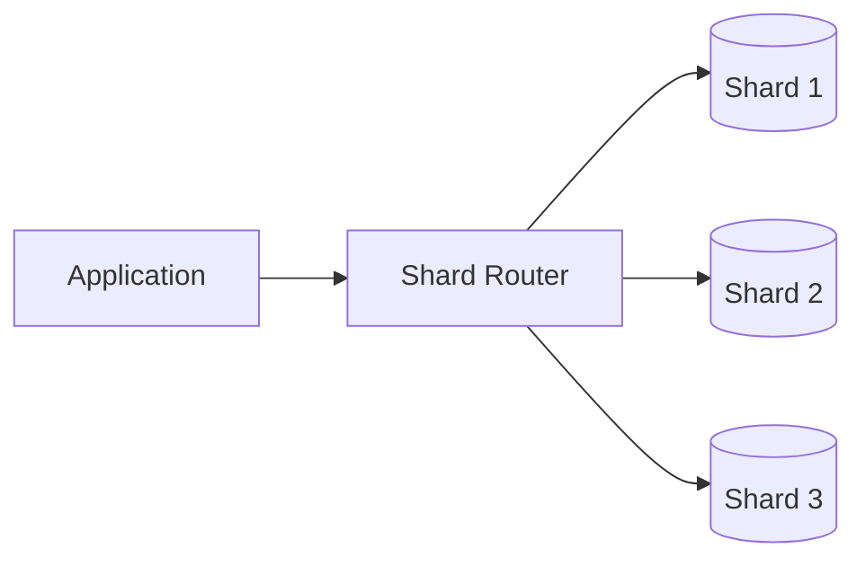
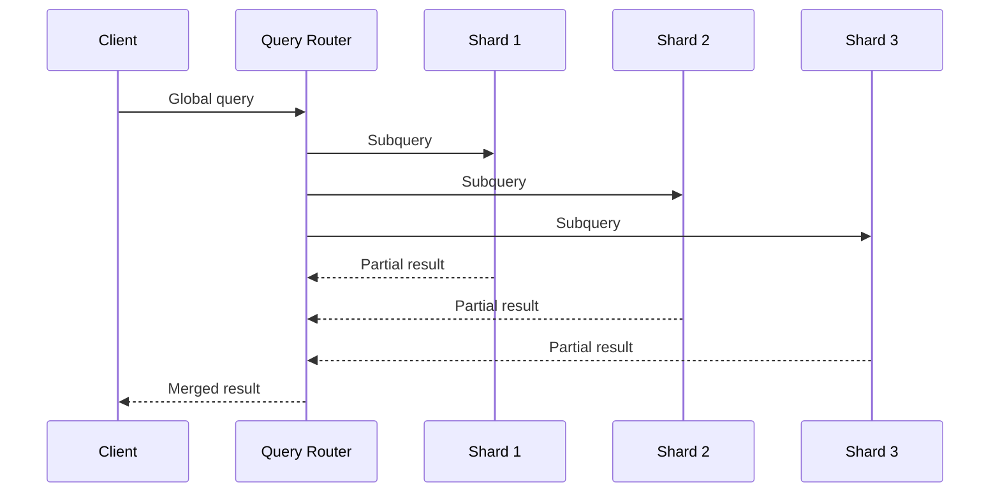
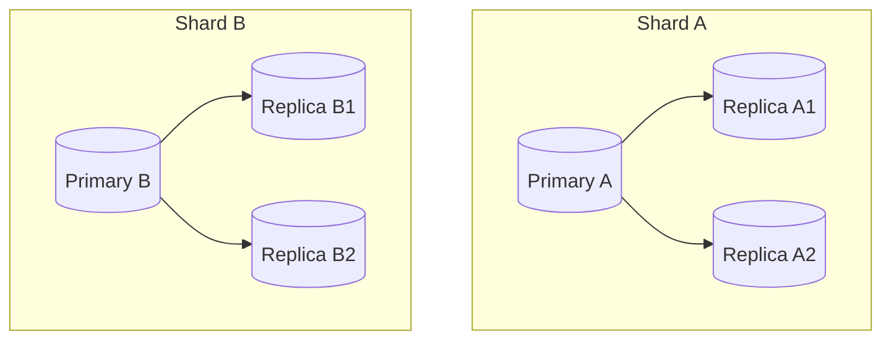

# DB Sharding

DB sharding is a horizontal partitioning strategy where one logical dataset is split across multiple physical database nodes (shards).

In system design, sharding is used when a single database instance cannot handle required write throughput, storage growth, or latency targets.

## Why Sharding Becomes Necessary

A single database eventually hits limits in:

- CPU and memory
- disk IOPS and storage capacity
- write contention and lock pressure
- network throughput

Vertical scaling helps for a while, but it is finite and expensive. Sharding enables scale-out by distributing load and data.

## Core Idea

Instead of storing all rows in one database:

- choose a sharding key (for example, `user_id`)
- route each record to a shard based on that key
- query only the relevant shard when possible

## Common Sharding Strategies

### 1. Range-Based Sharding

Data is split by value ranges (for example, users 1-1M, 1M-2M).

Pros:

- simple to understand
- efficient range scans inside one shard

Cons:

- hot shard risk if traffic is skewed toward recent/high ranges
- rebalancing can be painful

### 2. Hash-Based Sharding

Shard chosen by hash(shard_key) mod N.

Pros:

- more even data distribution
- reduces hotspot probability

Cons:

- range queries scatter across shards
- changing shard count can require heavy re-sharding (unless consistent hashing/virtual shards are used)

### 3. Directory/Lookup-Based Sharding

A mapping service decides shard placement for each key/tenant.

Pros:

- very flexible placement
- easier targeted migrations

Cons:

- adds metadata dependency
- router complexity increases

### 4. Geo/Tenant-Based Sharding

Shard by region or tenant id.

Pros:

- strong isolation per tenant/region
- can align with compliance boundaries

Cons:

- uneven tenant size can cause imbalance

## Choosing a Shard Key

A good shard key should:

- have high cardinality
- distribute writes evenly
- align with common query patterns
- remain stable over time

Bad shard keys create hotspots and expensive cross-shard operations.

## Query Patterns and Their Impact

### Single-Shard Queries

Best case for scalability and latency.

Example:

- `GET /users/{userId}` with shard key = `user_id`

### Cross-Shard Queries

Harder and slower.

Example:

- global leaderboard
- analytics across all users

Approaches:

- scatter-gather across shards
- pre-aggregated data stores
- ETL to analytical systems

## Transactions in a Sharded System

Single-shard transactions remain straightforward.

Cross-shard transactions are complex and costly:

- distributed transaction coordination (2PC) adds latency/failure complexity
- many teams avoid global ACID transactions and use eventual consistency

Design pattern:

- keep transaction boundaries aligned with shard key
- use saga/outbox patterns for cross-shard workflows

## Rebalancing and Re-Sharding

As data grows, some shards become larger or hotter.

Rebalancing approaches:

- split hot shards
- move chunks/partitions between shards
- use virtual shards to reduce migration cost

Rebalancing must be planned to minimize:

- write downtime
- query latency spikes
- dual-write inconsistencies

## Hotspot Management

Even with sharding, hotspots can occur.

Common causes:

- popular tenant
- monotonic keys
- skewed traffic patterns

Mitigations:

- random suffix/prefix on keys
- write buffering/queueing
- cache hot entities
- isolate heavy tenants

## Replication + Sharding

Production systems usually combine both:

- sharding for horizontal partitioning
- replication per shard for availability/read scaling

## Operational Concerns

You need strong tooling for:

- shard health and lag monitoring
- per-shard capacity planning
- online schema migrations
- backup/restore per shard
- failover automation

Metrics to track:

- QPS per shard
- p95/p99 latency per shard
- storage growth per shard
- hotspot and queue depth indicators

## Tradeoffs

Benefits:

- horizontal write/read scale
- larger total storage capacity
- fault isolation (one shard issue may not take down all data)

Costs:

- higher application complexity
- harder joins and cross-shard analytics
- more operational burden
- complex migrations and rebalancing

## Common Mistakes

- choosing shard key without analyzing access patterns
- ignoring hotspot probability
- running frequent cross-shard joins in OLTP path
- no plan for re-sharding from day one
- lacking observability at shard level

## Interview Framing

A strong medium-level answer for DB sharding should cover:

1. why single-node scaling is insufficient
2. shard key choice with tradeoffs
3. routing strategy and query implications
4. handling cross-shard operations and consistency
5. operational model (rebalancing, monitoring, failure handling)
6. how replication complements sharding

## Summary

DB sharding is a scale-out strategy for high-growth systems, but it shifts complexity from the database engine into architecture and operations. The success of sharding depends on shard key selection, workload-aware routing, and robust rebalancing and observability practices.
