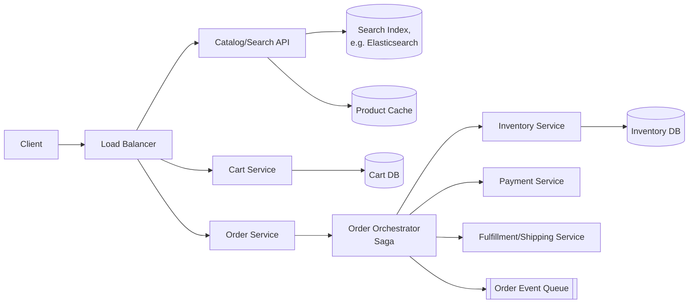
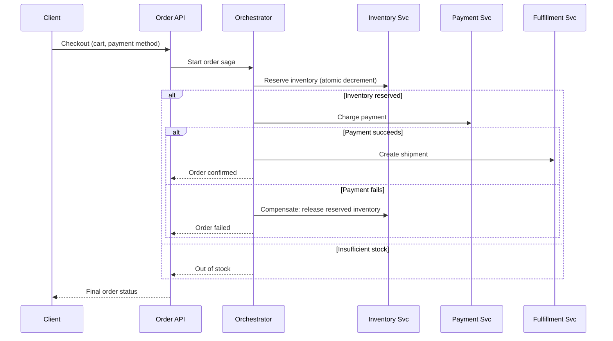
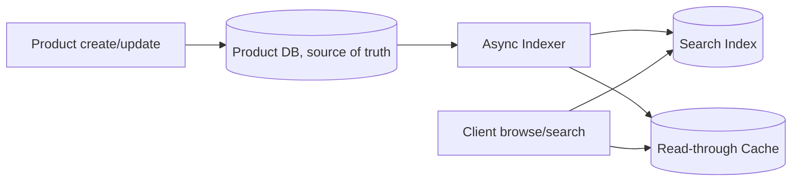

# Design Amazon (E-Commerce)

An e-commerce platform like Amazon must handle product search/catalog browsing, real-time inventory accuracy, cart/checkout, and reliable order processing — all while running flash sales that spike traffic by orders of magnitude.

In system design interviews, this question tests your understanding of inventory consistency, the order-processing saga pattern, and separating read-heavy catalog traffic from write-heavy, consistency-sensitive checkout traffic.

## 1. Problem Statement

Design a system like Amazon that supports:

- browsing/searching a massive product catalog
- adding items to a cart and checking out
- reliably placing orders without overselling inventory
- tracking order status through fulfillment/shipping

## 2. Requirements

### Functional

- Search and browse products with filters (category, price, rating).
- Add/remove items in a cart; checkout to place an order.
- Reserve/deduct inventory correctly, even under concurrent purchases.
- Process payment and route the order to fulfillment; track shipping status.

### Non-Functional

- Catalog browsing is extremely read-heavy; checkout is comparatively low-volume but must be strongly consistent.
- Never oversell inventory (no negative stock), even during flash sales with massive concurrency on the same item.
- High availability for browsing even if some backend systems (e.g., recommendations) degrade.
- Order processing must be reliable — no lost orders, no double charges.

## 3. Scale (Rough Estimate)

Assume:

- 300M active users, 500M product listings.
- Catalog reads: ~200K QPS average, spiking to millions of QPS during flash sales/major shopping events.
- Orders: ~10M orders/day (~115 writes/sec average, but a single flash-sale item can see thousands of concurrent purchase attempts in seconds).

Implications:

- Catalog/search must be served from heavily cached/denormalized read stores (not live joins against the inventory database).
- Inventory decrement for a single hot SKU is the classic contention point — needs atomic, low-latency operations (not naive read-then-write).
- Order placement spans multiple systems (inventory, payment, fulfillment) — a single ACID transaction across all of them isn't feasible, calling for a Saga-style workflow.

## 4. API Design

### Search / Browse

- `GET /api/v1/products/search?q={query}&filters=...`
- `GET /api/v1/products/{id}`

### Cart

- `POST /api/v1/cart/items` — Body: `productId`, `quantity`
- `GET /api/v1/cart`

### Checkout

- `POST /api/v1/orders` — Body: `cartId`, `shippingAddress`, `paymentMethodId`
- Response: `orderId`, `status: pending`

### Order Status

- `GET /api/v1/orders/{id}` — Response: `status` (pending/confirmed/shipped/delivered/cancelled)

## 5. High-Level Architecture



## 6. Database Schema

**products**

- `product_id` (PK), `title`, `description`, `price`, `category`, `rating`, `seller_id`
- Denormalized/cached copies power search results; this table is the source of truth.

**inventory**

- `product_id` (PK), `available_quantity`, `reserved_quantity`, `version` (for optimistic concurrency)

**carts / cart_items**

- `cart_id`, `user_id`; `cart_id`, `product_id`, `quantity`

**orders**

- `order_id` (PK), `user_id`, `status`, `total_amount`, `created_at`

**order_items**

- `order_id`, `product_id`, `quantity`, `unit_price`

**order_events** (append-only, drives the saga/audit trail)

- `order_id`, `event_type` (inventory_reserved/payment_charged/shipped/...), `timestamp`

## 7. Inventory Deduction (Avoiding Overselling)

A naive "read stock, check > 0, write stock - 1" is a race condition under concurrency. Use an atomic, conditional decrement instead:

```sql
UPDATE inventory
SET available_quantity = available_quantity - :qty,
    version = version + 1
WHERE product_id = :product_id
  AND available_quantity >= :qty
  AND version = :expected_version;
-- If 0 rows affected, someone else won the race (or stock ran out) — retry or fail the reservation.
```

This single atomic statement (optimistic concurrency via `version`, plus the `>=` guard) ensures stock never goes negative even with thousands of concurrent requests on the same SKU.

## 8. Order Placement Flow (Saga Pattern)

Placing an order touches inventory, payment, and fulfillment — three systems that can't share a single database transaction. A **Saga** coordinates them as a sequence of local transactions, each with a compensating action if a later step fails.



## 9. Catalog Read Pipeline



Product edits write to the source-of-truth DB, then propagate asynchronously to the search index and cache — browsing traffic never touches the transactional product DB directly, keeping catalog reads fast and isolated from write load.

## 10. Key Components

- **Catalog/search service** — read-optimized, backed by a dedicated search index and aggressive caching, isolated from transactional systems.
- **Inventory service** — the contention hotspot; relies on atomic conditional updates (or distributed locks/queues for extreme hot-SKU cases) to prevent overselling.
- **Order orchestrator (Saga)** — coordinates inventory, payment, and fulfillment as compensable steps instead of a single distributed transaction.
- **Cart service** — comparatively simple key-value-style storage per user, low contention.
- **Fulfillment/shipping service** — downstream of order confirmation, tracks physical delivery state asynchronously.

## 11. Key Challenges

- **Flash-sale hot SKU contention** — thousands of simultaneous buyers targeting one item; atomic conditional decrements (or a per-SKU queue that serializes reservations) prevent overselling without heavy locking across the whole inventory table.
- **Saga compensation correctness** — every step needs a well-defined compensating action (e.g., release inventory, refund payment); missing this leads to orders stuck in inconsistent states.
- **Cache staleness in catalog** — price/availability shown to a browsing user might be milliseconds stale; checkout must always re-validate against the source of truth, never trust the cached price/stock blindly.
- **Idempotent checkout** — a retried checkout request (e.g., due to a client timeout) must not create two orders or charge twice; requires an idempotency key on the order-creation API.

## 12. Interview Tips

- Call out explicitly that overselling prevention requires an atomic conditional update (not read-then-write) — this is the detail interviewers most want to hear for the inventory piece.
- Use the Saga pattern by name when discussing order placement across inventory/payment/fulfillment; mention compensating transactions specifically.
- Separate catalog/search (read-heavy, cache/index-backed) from checkout (write-heavy, consistency-sensitive) early — treating the whole system as one monolithic data path is a common weak answer.
- If asked about flash sales specifically, mention queueing purchase attempts per hot SKU as an alternative/complement to optimistic concurrency at extreme contention levels.

## 13. Summary

Amazon's architecture splits into a read-optimized catalog/search path (cached, indexed, decoupled from transactional data) and a consistency-critical checkout path built around atomic inventory updates and a Saga-based order orchestrator that coordinates inventory, payment, and fulfillment with explicit compensating actions. This separation lets browsing scale near-infinitely while keeping the comparatively rare, but high-stakes, checkout path correct even under flash-sale contention.
