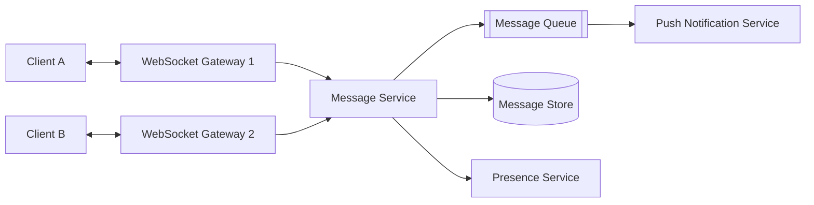
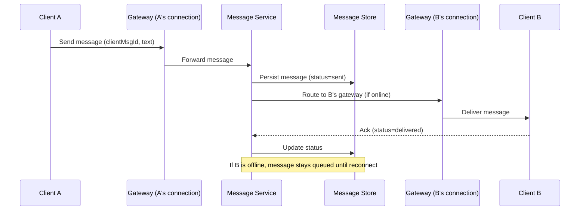

# Design a Chat / Messaging System

A chat system lets users exchange messages in real time, one-on-one or in groups, with reliable delivery even when recipients are temporarily offline.

In system design interviews, this question tests your understanding of persistent connections, message ordering, delivery guarantees, and offline synchronization — similar to how WhatsApp or Slack operate.

## 1. Problem Statement

Design a system like WhatsApp that supports:

- one-on-one and group messaging
- real-time delivery to online users
- reliable delivery to offline users once they reconnect
- read receipts and delivery status (sent/delivered/read)

## 2. Functional Requirements

- Send/receive text messages in real time.
- Support group conversations.
- Persist message history.
- Show delivery/read status.
- Sync missed messages when a user comes back online.

## 3. Non-Functional Requirements

- Low latency delivery (under ~200ms) for online users.
- Messages must not be lost, even if a server crashes mid-delivery.
- Support millions of concurrent connections.
- Ordered delivery within a conversation.

## 4. High-Level Architecture

Clients keep a persistent WebSocket connection to a gateway node. Because a sender and recipient may be connected to *different* gateway nodes, the message service (backed by a queue/pub-sub layer) routes messages between gateways.

## 5. Message Delivery Flow

## 6. Message Ordering & Delivery Guarantees

- Each message gets a unique, monotonically increasing id per conversation (not just a timestamp, to avoid clock skew issues).
- Clients send messages with a **client-generated id** so retries don't create duplicates (idempotency / deduplication).
- Delivery guarantee is typically **at-least-once** — clients must dedupe by message id, since exactly-once delivery across a network is impractical.

## 7. Data Model

Conversation-partitioned message store:

- `conversation_id` (partition key)
- `message_id` (sortable, e.g., Snowflake-style id)
- `sender_id`, `text`, `created_at`, `status`

Partitioning by `conversation_id` keeps a conversation's messages together for fast, ordered reads, and spreads load across many conversations.

## 8. Offline Sync

- Each user has a per-device "last synced message id" cursor.
- On reconnect, the client asks: "give me everything since cursor X" for each conversation.
- Undelivered messages are stored in a per-user inbox/queue until acknowledged.

## 9. Presence & Read Receipts

- A lightweight presence service tracks online/offline status via heartbeats over the WebSocket connection.
- Read receipts are just another event type flowing through the same message pipeline, updating message status in the store.

## 10. Scalability Considerations

- WebSocket gateways are stateful (they hold connections) — scale horizontally, use sticky routing via a connection registry (e.g., "user X is connected to gateway 7") stored in Redis.
- Use a pub-sub layer (Kafka/Redis Streams) between gateways so any gateway can deliver to any user regardless of which gateway they're connected to.
- Shard message storage by `conversation_id` to scale writes/reads.

## 11. Tradeoffs

- At-least-once delivery is simpler and safer than exactly-once, but pushes deduplication work to clients.
- Storing full history forever vs. archiving old conversations to cold storage for cost control.
- Strong ordering per conversation is easy; global ordering across all conversations is unnecessary and expensive.

## 12. Common Mistakes

- Relying on server timestamps alone for message ordering (clock skew causes out-of-order messages).
- Making WebSocket gateways aware of all users globally instead of using a pub-sub layer to bridge gateways.
- No client-side dedup, causing duplicate messages on retry.
- Forgetting offline delivery entirely and assuming users are always connected.

## 13. Summary

A chat system's core challenge isn't sending one message — it's reliably routing messages between users connected to different servers, guaranteeing ordered, at-least-once delivery, and syncing missed messages for offline users. WebSocket gateways plus a pub-sub backbone and per-conversation storage handle this at scale.
