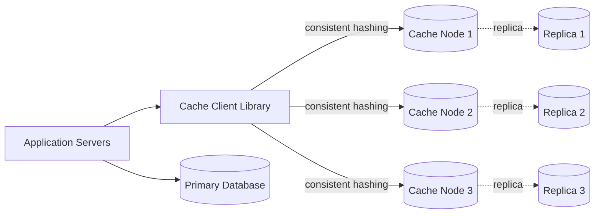
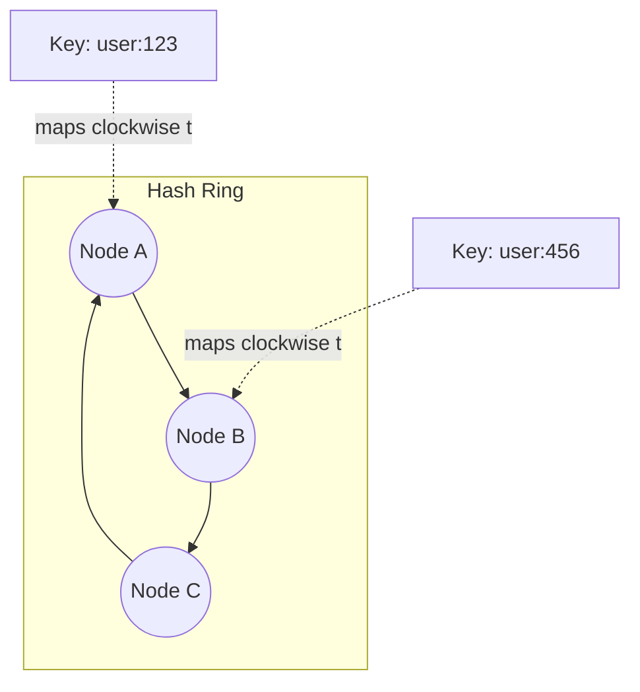
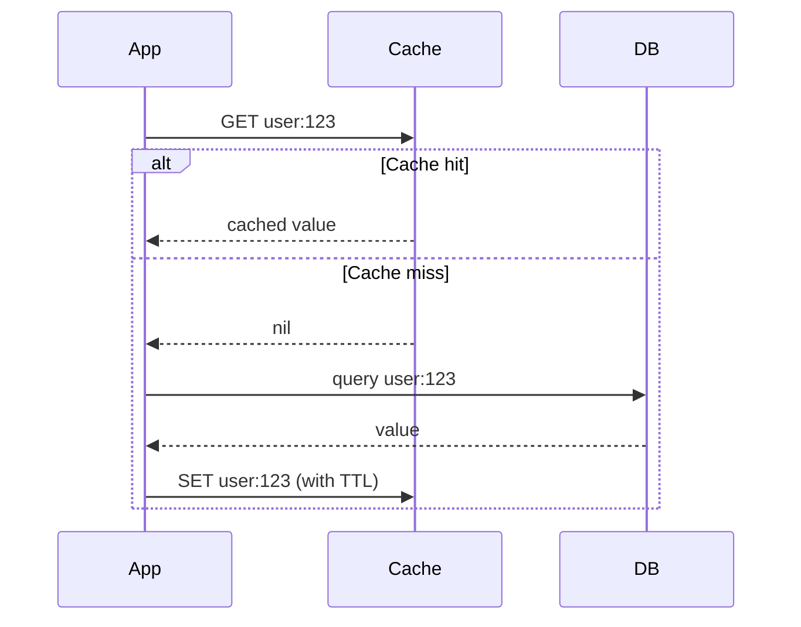

# Design a Distributed Cache

A distributed cache stores frequently accessed data in memory across multiple nodes, dramatically reducing latency and database load for read-heavy systems.

In system design interviews, this question tests your understanding of consistent hashing, eviction policies, replication, and handling cache failure scenarios like the "thundering herd" problem.

## 1. Problem Statement

Design a system like a Redis Cluster or Memcached pool that:

- stores key-value pairs in memory across multiple nodes
- serves reads/writes with sub-millisecond latency
- scales horizontally as data grows
- stays available when individual nodes fail

## 2. Functional Requirements

- `GET(key)`, `SET(key, value, ttl)`, `DELETE(key)` operations.
- Support expiration (TTL) per key.
- Distribute keys evenly across nodes.
- Support adding/removing nodes without a full cache wipe.

## 3. Non-Functional Requirements

- Very low latency (sub-millisecond to a few ms).
- High throughput (hundreds of thousands of ops/sec).
- Graceful behavior on node failure (no full outage).
- Memory efficiency and predictable eviction behavior.

## 4. High-Level Architecture

The client library (or a proxy layer) decides which node owns a key and routes requests directly there — this is what makes the cache "distributed" rather than a single shared instance.

## 5. Consistent Hashing

Instead of `hash(key) % N` (which reshuffles almost everything when N changes), consistent hashing places both nodes and keys on a hash ring:

- Each key maps clockwise to the nearest node on the ring.
- Adding/removing a node only remaps the keys between it and its neighbor — not the entire keyspace.
- Virtual nodes (multiple ring positions per physical node) keep load evenly distributed.

## 6. Eviction Policies

| Policy | Behavior | Good for |
|---|---|---|
| LRU (Least Recently Used) | Evicts the item not accessed for the longest time | General-purpose caching |
| LFU (Least Frequently Used) | Evicts the item accessed least often | Skewed access patterns (hot/cold keys) |
| TTL-based | Items expire after a fixed time regardless of usage | Data with natural freshness windows |

Redis and Memcached both default to approximate LRU for performance reasons (exact LRU is expensive to track at scale).

## 7. Cache Strategies

- **Cache-aside (lazy loading)**: app checks cache first; on miss, reads DB and populates cache. Most common, simple to reason about.
- **Write-through**: app writes to cache and DB together, keeping cache always fresh at the cost of write latency.
- **Write-behind (write-back)**: app writes to cache, and the cache asynchronously flushes to DB — fast writes, risk of data loss on crash.

## 8. Cache Miss / Read Flow

## 9. The Thundering Herd / Cache Stampede Problem

When a hot key expires, thousands of concurrent requests can all miss the cache at once and hammer the database simultaneously. Mitigations:

- **Request coalescing / locking**: only one request recomputes the value; others wait for it.
- **Early recomputation**: refresh the value slightly before it expires (probabilistic early expiration).
- **Stale-while-revalidate**: serve the slightly stale value while refreshing in the background.

## 10. Scalability & Availability

- Add replicas per shard so a node failure doesn't cause data loss or downtime.
- Use gossip protocols (like Redis Cluster) for node membership and failure detection.
- Monitor hot keys — a single extremely popular key can overload one node even with consistent hashing.

## 11. Tradeoffs

- More replicas improve availability but increase memory cost and write complexity.
- Write-through keeps data fresh but slows writes; cache-aside is simpler but has a "cold" first request.
- Exact LRU is precise but costly; approximate LRU scales better with a small accuracy tradeoff.

## 12. Common Mistakes

- Using modulo hashing instead of consistent hashing, causing mass cache invalidation on scaling events.
- No TTL, leading to unbounded memory growth and stale data.
- No stampede protection on hot keys.
- Treating the cache as a source of truth instead of a disposable, rebuildable layer.

## 13. Summary

A distributed cache trades a small amount of consistency for a large gain in latency and database offload. Consistent hashing solves distribution, replication solves availability, and stampede-protection techniques solve the biggest real-world failure mode: everyone missing the cache at the same time.
