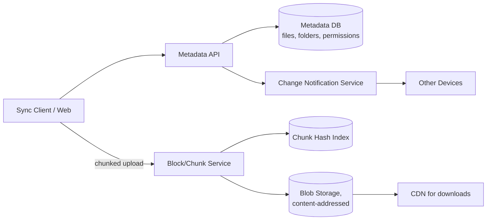
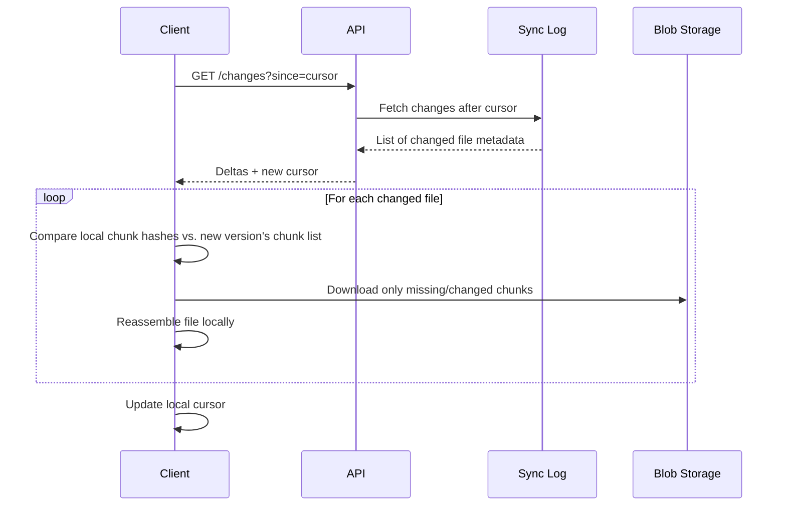
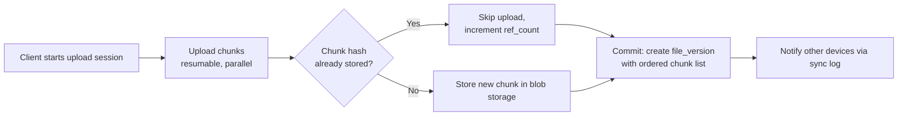

# Design Google Drive (File Storage)

Google Drive lets users upload, sync, and share files/folders across devices, handling large files efficiently, keeping multiple devices in sync, and resolving edits made while offline.

In system design interviews, this question tests your understanding of chunked upload/dedup, metadata vs. blob storage separation, delta sync, and conflict resolution.

## 1. Problem Statement

Design a system like Google Drive that supports:

- uploading/downloading files and organizing them into folders
- syncing changes across multiple devices automatically
- sharing files/folders with specific permissions
- keeping older versions of a file recoverable

## 2. Requirements

### Functional

- Upload/download files; organize into a folder hierarchy.
- Sync client detects local changes and uploads only what changed.
- Share files/folders with view/edit permissions.
- Maintain version history and allow reverting.

### Non-Functional

- Large files (GBs) must upload/resume reliably over unreliable networks.
- Storage efficiency — avoid storing duplicate content redundantly.
- Strong consistency for metadata (folder structure, permissions); eventual consistency acceptable for sync propagation delay.
- High durability for stored file content (effectively never lose data).

## 3. Scale (Rough Estimate)

Assume:

- 1B users, average 5GB stored each → ~5 exabytes of total storage.
- 100M file uploads/day, many of which are edits to existing files, not brand-new content.
- Average file size varies hugely (KBs for docs, GBs for videos) — the system must handle both efficiently.

Implications:

- Storing whole-file copies for every edit would be enormously wasteful — chunking + content-addressable dedup is essential.
- Metadata (folder tree, permissions, filenames) is comparatively small and needs strong consistency; blob content is comparatively huge and needs cheap, durable, eventually-consistent replication.
- Sync clients must transfer only changed chunks, not whole files, to keep bandwidth and battery usage reasonable.

## 4. API Design

### Upload File (Chunked)

- `POST /api/v1/files` — create file metadata, returns `fileId` and an upload session.
- `PUT /api/v1/files/{id}/chunks/{chunkIndex}` — upload one chunk (supports resumable upload).
- `POST /api/v1/files/{id}/commit` — finalize once all chunks are uploaded.

### Download File

- `GET /api/v1/files/{id}/content` — streams/redirects to blob storage.

### List / Sync Changes

- `GET /api/v1/changes?since=cursor` — returns metadata deltas since the last sync cursor (used by sync clients).

### Share

- `POST /api/v1/files/{id}/permissions` — Body: `granteeUserId`, `role` (viewer/editor).

## 5. High-Level Architecture



## 6. Database Schema

**files**

- `file_id` (PK), `owner_id`, `name`, `parent_folder_id`, `size`, `mime_type`, `current_version_id`, `updated_at`

**folders**

- `folder_id` (PK), `owner_id`, `name`, `parent_folder_id`

**file_versions**

- `version_id` (PK), `file_id`, `created_at`, `chunk_list` (ordered list of `chunk_hash`)

**chunks** (content-addressable, deduplicated)

- `chunk_hash` (PK, e.g., SHA-256 of chunk bytes), `blob_storage_ref`, `size`, `ref_count`

**permissions**

- `file_id` or `folder_id`, `user_id`, `role` (owner/editor/viewer)

**sync_log** (per-user change feed, used for delta sync)

- `user_id`, `change_id` (monotonic cursor), `entity_type`, `entity_id`, `change_type` (create/update/delete/move)

## 7. Chunking and Content-Addressable Deduplication (Code)

Files are split into fixed- or content-defined chunks; each chunk is identified by the hash of its content. If two users (or two versions of the same file) contain an identical chunk, it's stored once and referenced by both.

```python
CHUNK_SIZE = 4 * 1024 * 1024  # 4MB

def chunk_and_hash(file_stream):
    chunks = []
    while True:
        data = file_stream.read(CHUNK_SIZE)
        if not data:
            break
        chunk_hash = sha256(data).hexdigest()
        chunks.append((chunk_hash, data))
    return chunks

def upload_file_version(file_id, file_stream):
    chunk_hashes = []
    for chunk_hash, data in chunk_and_hash(file_stream):
        if not chunk_index_exists(chunk_hash):
            blob_ref = blob_store.put(data)
            chunk_index_put(chunk_hash, blob_ref, ref_count=1)
        else:
            chunk_index_increment_ref(chunk_hash)  # dedup: reuse existing chunk
        chunk_hashes.append(chunk_hash)

    version_id = db.insert_file_version(file_id, chunk_hashes)
    db.update_file_current_version(file_id, version_id)
    return version_id
```

Only chunks that changed between versions need to be re-uploaded — a small edit to a large file re-transfers only the affected chunks, not the whole file (this is the basis for efficient delta sync).

## 8. Delta Sync Flow



## 9. Upload / Commit Pipeline



Resumable, chunked uploads mean a dropped connection only requires re-uploading the last incomplete chunk, not restarting the entire file.

## 10. Conflict Resolution

When two devices edit the same file offline and reconnect:

- Detect conflict by comparing the version each client started from vs. the file's current version at commit time.
- If they diverge, keep both: commit the second writer as a new version and create a "conflicted copy" file, rather than silently overwriting — this mirrors how real sync clients (Drive, Dropbox) behave.
- Folder-structure conflicts (e.g., same name created in two places) are resolved similarly by keeping both and renaming one.

## 11. Key Components

- **Metadata service** — the strongly-consistent source of truth for folder structure, filenames, and permissions; comparatively small in volume.
- **Chunking/dedup service** — splits files into content-addressed chunks, the core mechanism for both storage efficiency and delta sync.
- **Blob storage** — durable, cheap, highly replicated storage for chunk content, decoupled from metadata.
- **Sync log (change feed)** — an ordered, per-user log of metadata changes that sync clients page through incrementally instead of re-scanning the whole account each time.
- **Permission service** — enforces sharing rules on every read/write, checked against the metadata store.

## 12. Key Challenges

- **Large file resumable uploads** — network drops must not force a full re-upload; chunk-level resumability is essential.
- **Deduplication reference counting** — deleting a file must decrement chunk `ref_count` and only physically delete a chunk's blob when no file references it anymore.
- **Conflict resolution UX** — must avoid silent data loss on concurrent offline edits, even at the cost of occasionally creating duplicate "conflicted copy" files.
- **Metadata scalability** — folder trees can be deep and permissions can inherit; listing a folder's effective permissions efficiently (without walking the whole ancestor chain on every request) requires careful indexing/caching.

## 13. Interview Tips

- Lead with the separation of metadata (small, strongly consistent) from blob content (huge, eventually consistent, durable) — this split is the foundation of the whole design.
- Bring up content-addressable chunking early; it directly explains both deduplication and efficient delta sync in one mechanism.
- Discuss conflict resolution explicitly — interviewers want to see you handle the "two devices edited offline" case rather than assuming a single always-online writer.
- Mention resumable/chunked uploads as the practical answer to "what happens if the network drops mid-upload of a 2GB file".

## 14. Summary

Google Drive's architecture separates lightweight, strongly-consistent metadata from massive, content-addressed blob storage, using chunking to enable both deduplication and efficient delta sync across devices. A per-user sync log lets clients pull incremental changes instead of re-scanning everything, while explicit conflict detection (rather than silent overwrites) keeps concurrent offline edits safe.
