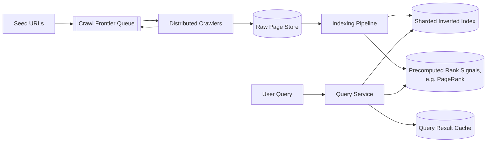
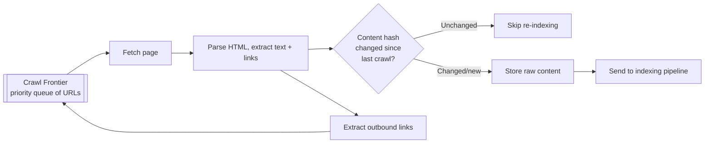
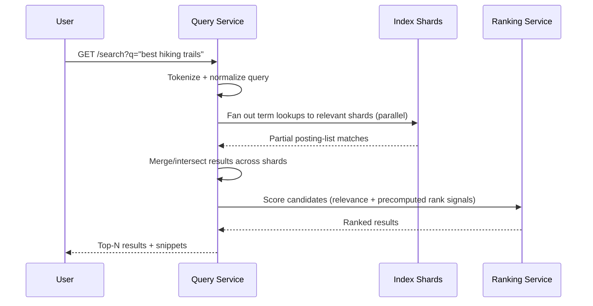
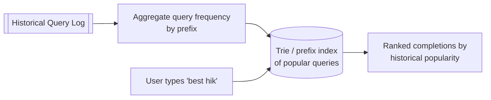

# Design Google Search (Search Engine)

A web search engine crawls billions of pages, builds an inverted index over their content, and answers keyword queries in milliseconds with results ranked by relevance and authority.

In system design interviews, this question tests your understanding of inverted indexes, the crawl-index-serve pipeline, and how ranking combines relevance signals (like PageRank) with query-time features.

## 1. Problem Statement

Design a system like Google Search that supports:

- crawling and indexing a large portion of the public web
- answering keyword queries with relevant, ranked results in milliseconds
- ranking results using both content relevance and page authority
- handling typos and offering autocomplete suggestions

## 2. Requirements

### Functional

- Crawl web pages, extract and index their text content.
- Accept a text query and return a ranked list of matching pages.
- Rank by a combination of keyword relevance and page authority/quality.
- Support autocomplete and basic spelling correction.

### Non-Functional

- Query latency must be in the tens/low-hundreds of milliseconds even across a web-scale index.
- The web changes constantly — the index must be refreshed continuously, not rebuilt from scratch.
- Massive read (query) volume vs. a separate, also-massive but decoupled crawl/index write pipeline.
- High availability — search is often the entry point to the entire web for users.

## 3. Scale (Rough Estimate)

Assume:

- Tens of billions of indexed web pages.
- ~100K+ queries/sec globally at peak (Google-scale; a smaller vertical search engine would be far less, but the architecture shape is the same).
- Average query touches a tiny fraction of the index (relevant documents for the given terms), not the whole corpus.

Implications:

- The inverted index must be sharded across many machines, since no single node can hold or search a web-scale index.
- Crawling, indexing, and serving are three independent pipelines with very different scaling and latency needs — they must not be coupled into one synchronous path.
- Ranking must be precomputed where possible (e.g., page authority scores) so query-time ranking only combines precomputed signals with lightweight relevance scoring, rather than computing everything from scratch per query.

## 4. API Design

### Search Query

- `GET /api/v1/search?q={query}&page={n}`
- Response: ranked list of `{ url, title, snippet, score }`

### Autocomplete

- `GET /api/v1/autocomplete?prefix={text}`
- Response: list of suggested completions, ranked by popularity.

### (Internal) Crawl Submission

- `POST /api/v1/internal/crawl-queue` — Body: `url`, `priority` (used by the crawler's frontier, not exposed publicly).

## 5. High-Level Architecture



## 6. Database Schema

**pages** (raw crawled content)

- `url` (PK), `raw_html`, `crawled_at`, `content_hash` (to detect unchanged pages on re-crawl)

**inverted_index** (sharded, e.g., by term hash)

- `term` → posting list of `(doc_id, term_frequency, positions[])`

**documents** (metadata per indexed page)

- `doc_id` (PK), `url`, `title`, `snippet_source`, `last_indexed_at`

**rank_signals** (precomputed, refreshed periodically)

- `doc_id`, `pagerank_score`, `domain_authority`, `spam_score`

**query_log** (for autocomplete/analytics)

- `query_text`, `timestamp`, `result_clicked_doc_id`

## 7. Crawling Pipeline



- The frontier is a priority queue balancing crawl freshness (how often a site changes) against politeness (rate-limiting requests per domain to avoid overloading any single site).
- Content hashing avoids re-indexing pages that haven't actually changed since the last crawl, saving significant indexing work.

## 8. Building the Inverted Index (Code)

An inverted index maps each term to the list of documents containing it, which is what makes keyword search fast — instead of scanning every document per query, the query only looks up the (few) relevant terms.

```python
def build_index_for_document(doc_id, text):
    tokens = tokenize_and_normalize(text)  # lowercase, strip punctuation, stemming
    term_positions = defaultdict(list)
    for position, token in enumerate(tokens):
        term_positions[token].append(position)

    for term, positions in term_positions.items():
        inverted_index.append_posting(
            term=term,
            doc_id=doc_id,
            term_frequency=len(positions),
            positions=positions,  # enables phrase queries like "exact match"
        )

def search(query_text, top_k=10):
    query_terms = tokenize_and_normalize(query_text)
    posting_lists = [inverted_index.get_postings(term) for term in query_terms]
    candidate_docs = intersect_posting_lists(posting_lists)  # docs containing all/most terms

    scored = [(doc_id, score_document(doc_id, query_terms)) for doc_id in candidate_docs]
    scored.sort(key=lambda x: -x[1])
    return scored[:top_k]
```

The index is sharded across many machines (e.g., by term hash or document range), and a query fans out to the relevant shards in parallel, merging partial results before final ranking.

## 9. Query Flow



## 10. Ranking: Relevance + Authority

Final ranking blends two categories of signal:

| Signal type | Example | Computed |
|---|---|---|
| Query relevance | TF-IDF/BM25 score of query terms in the document | At query time, cheap, over the small candidate set |
| Page authority | PageRank-style score based on inbound links from other pages | Precomputed offline, refreshed periodically |
| Freshness/quality | Recency, spam score, mobile-friendliness | Precomputed/cached signals, blended at query time |

```text
final_score = w1 * relevance_score(query, doc)
            + w2 * pagerank_score(doc)
            + w3 * freshness_score(doc)
```

Precomputing the expensive, link-graph-wide signal (PageRank) offline means query-time ranking only has to combine a handful of already-computed numbers with a cheap relevance calculation — keeping queries fast despite the underlying complexity.

## 11. Autocomplete Pipeline



A prefix trie (or similarly structured index) built from aggregated historical query popularity lets autocomplete return suggestions in constant/near-constant time per keystroke.

## 12. Key Components

- **Distributed crawler + frontier** — continuously discovers and re-fetches pages, balancing freshness against per-domain politeness limits.
- **Sharded inverted index** — the core data structure enabling fast keyword lookup across a web-scale corpus; queries fan out to relevant shards in parallel.
- **Precomputed rank signals (PageRank, etc.)** — expensive, offline, link-graph-wide computation decoupled entirely from the query-serving path.
- **Query service** — tokenizes queries, merges sharded results, and combines relevance with precomputed authority signals for final ranking.
- **Autocomplete index** — a separate, lightweight prefix-based structure built from aggregated query logs.

## 13. Key Challenges

- **Index freshness vs. crawl cost** — the web changes constantly; re-crawling everything constantly is wasteful, so crawl priority must be based on how often a given page historically changes.
- **Query latency at web scale** — solved by sharding the index and parallelizing lookups, plus precomputing expensive signals like PageRank offline rather than at query time.
- **Spam/low-quality content** — ranking must actively down-weight manipulative link schemes or low-quality pages, not just naively trust raw link counts.
- **Ambiguous/short queries** — a two-word query can have many valid interpretations; ranking must lean on relevance signals, user context, and click-through history rather than pure keyword matching alone.

## 14. Interview Tips

- Lead with the inverted index as the foundational data structure — explain why it turns "search the whole web" into "look up a few terms" and how sharding parallelizes that lookup.
- Separate the three pipelines explicitly — crawling, indexing, and serving — and describe why they run independently and asynchronously rather than as one synchronous flow.
- Bring up PageRank (or a generic "precomputed authority signal") as an offline computation blended with query-time relevance — this shows you understand where expensive computation belongs.
- Autocomplete and spell correction are good bonus topics if time remains, but shouldn't take time away from the core crawl/index/rank discussion.

## 15. Summary

A web search engine is really three loosely-coupled pipelines: a distributed crawler that continuously discovers and re-fetches pages, an indexing pipeline that builds a sharded inverted index (plus offline signals like PageRank), and a query service that fans out to index shards and blends relevance with precomputed authority to return ranked results in milliseconds. Keeping these pipelines decoupled is what lets a web-scale corpus stay both fresh and fast to query.
