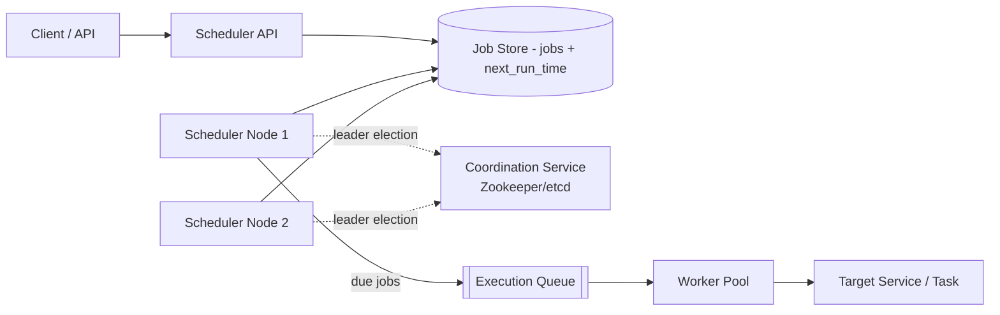
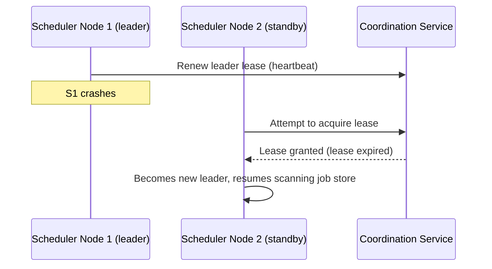
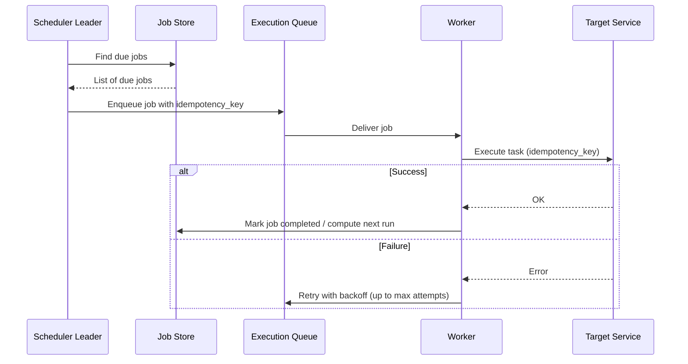

# Design a Distributed Job Scheduler

A distributed job scheduler triggers tasks (one-off or recurring) at the right time, exactly once (or safely retryable), even as the scheduler itself runs across multiple machines for reliability.

In system design interviews, this question tests your understanding of leader election, idempotency, and handling clock/timing issues in a distributed environment — similar to how cron-as-a-service systems, Airflow, or Kubernetes CronJobs work.

## 1. Problem Statement

Design a system that lets users schedule jobs like:

- "run this task every day at 2 AM"
- "run this task once, 10 minutes from now"

...and guarantees the task runs even if individual scheduler nodes crash, without running it multiple times unnecessarily.

## 2. Functional Requirements

- Schedule one-time and recurring (cron-style) jobs.
- Execute jobs at the correct time, reliably.
- Retry failed jobs with backoff.
- Allow cancelling/updating scheduled jobs.

## 3. Non-Functional Requirements

- No job should be lost, even if a scheduler node crashes mid-cycle.
- Jobs should not run duplicated under normal operation (idempotency handles the rare duplicate case).
- Must scale to millions of scheduled jobs across many tenants.

## 4. High-Level Architecture

Multiple scheduler nodes run for high availability, but only the elected **leader** actively scans for due jobs and enqueues them — avoiding duplicate dispatch.

## 5. Leader Election

- Scheduler nodes register with a coordination service (Zookeeper/etcd/Consul) and compete for a leader lock.
- Only the leader polls the job store for due jobs and pushes them to the execution queue.
- If the leader crashes, its lock lease expires and another node takes over within seconds — no jobs are missed because due-jobs live in durable storage, not in the leader's memory.

## 6. Job Store & Scanning

- Jobs table: `job_id`, `cron_expression` or `run_at`, `next_run_time`, `status`, `payload`.
- Leader periodically queries: "give me all jobs where `next_run_time <= now` and `status = scheduled`", locks them (e.g., via a `SELECT ... FOR UPDATE` or a claim token), and pushes them to the execution queue.
- After dispatch, `next_run_time` is recalculated for recurring jobs (or status set to `completed` for one-time jobs).

## 7. Execution Flow

## 8. Idempotency for Retried Jobs

- Every dispatched execution carries a unique `idempotency_key` (e.g., `job_id + scheduled_time`).
- The target service stores recently seen idempotency keys and ignores duplicates — so if a job is redelivered (worker crash, network retry, at-least-once queue semantics), it doesn't double-execute (e.g., doesn't charge a customer twice).

## 9. Handling Clock Drift & Missed Schedules

- Scheduler nodes should sync time via NTP; small drift is tolerated by scanning slightly ahead of `now`.
- If the scheduler was down when a job was due (e.g., during a leader failover), the job store still shows it as overdue — the new leader picks it up immediately on the next scan (with a policy for "skip if too late" vs "run late" depending on job type).

## 10. Scalability Considerations

- Shard the job store by `job_id` hash or tenant so scanning for due jobs can be parallelized across partitions.
- Only one leader per shard scans/dispatches, keeping dispatch logic simple while still scaling horizontally across shards.
- Execution queue and worker pool scale independently from the scheduling/leader logic.

## 11. Tradeoffs

- Single global leader is simple but limits scan throughput — sharding adds complexity but scales further.
- At-least-once dispatch (with idempotency) is far simpler to build than trying to guarantee exactly-once execution.
- Fine-grained per-second scheduling requires more frequent scans, increasing load on the job store.

## 12. Common Mistakes

- Letting every scheduler node independently dispatch jobs (causes duplicate execution).
- Storing `next_run_time` only in memory, losing schedules on crash.
- No idempotency key, so retried jobs cause duplicate side effects (e.g., duplicate emails or charges).
- Ignoring backoff/retry limits, causing a failing job to spin forever.

## 13. Summary

A distributed job scheduler relies on a durable job store as the source of truth, leader election to avoid duplicate dispatch, and idempotency keys to safely tolerate at-least-once execution semantics — the same pattern used by cron-as-a-service platforms and workflow engines like Airflow.
