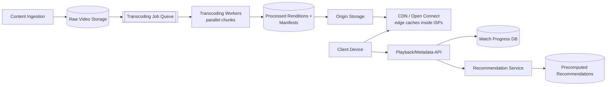
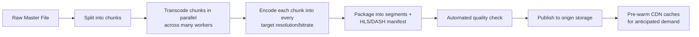
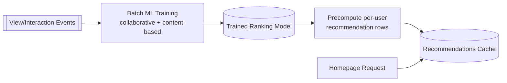

# Design Netflix (Video Streaming)

Netflix ingests studio-quality video, transcodes it into many resolutions/bitrates, and streams it smoothly to hundreds of millions of subscribers across wildly varying devices and network conditions worldwide.

In system design interviews, this question tests your understanding of media transcoding pipelines, adaptive bitrate streaming, CDN placement, and how personalization/recommendation integrates with playback.

## 1. Problem Statement

Design a system like Netflix that supports:

- ingesting and processing studio video content into streamable formats
- adaptive-bitrate playback that adjusts smoothly to network conditions
- personalized recommendations and a "continue watching" experience across devices
- global low-latency delivery

## 2. Requirements

### Functional

- Ingest source video and produce multiple resolution/bitrate renditions.
- Stream video with adaptive bitrate switching mid-playback.
- Track watch progress per user/device for "continue watching".
- Serve a personalized homepage (recommendations, in addition to browsing/search).

### Non-Functional

- Very low playback start latency and minimal rebuffering.
- Massive read (streaming) scale vs. comparatively tiny write (ingestion) scale.
- Global delivery with regional low latency (a big driver of Netflix's own CDN, "Open Connect").
- High availability — a playback outage directly impacts revenue and trust.

## 3. Scale (Rough Estimate)

Assume:

- 250M subscribers, ~15% watching concurrently at peak → ~35M concurrent streams.
- Average bitrate ~5 Mbps for HD → peak aggregate egress bandwidth in the tens of terabits/sec, overwhelmingly served from CDN edge, not origin.
- A handful of thousands of new titles/episodes ingested per week — ingestion volume is tiny compared to playback volume.

Implications:

- CDN edge caching (or a dedicated CDN like Open Connect placed inside ISPs) is not optional — origin servers could never serve this bandwidth directly.
- Transcoding is a batch, asynchronous, and highly parallelizable pipeline — it is off the playback critical path entirely.
- Personalization/recommendation must be precomputed/cached per user; computing it synchronously on every homepage load would be far too slow.

## 4. API Design

### Playback Manifest

- `GET /api/v1/titles/{id}/manifest` — returns an HLS/DASH manifest listing available renditions (resolution/bitrate) and segment URLs.

### Playback Progress

- `POST /api/v1/playback/progress` — Body: `titleId`, `positionSeconds`, `deviceId` (used to resume "continue watching" on any device).

### Browse / Homepage Rows

- `GET /api/v1/home` — returns precomputed personalized rows (e.g., "Continue Watching", "Because you watched X", "Trending").

### Search

- `GET /api/v1/search?q={query}`

## 5. High-Level Architecture



## 6. Database Schema

**titles**

- `title_id` (PK), `name`, `type` (movie/series), `metadata` (genre, cast, description)

**renditions**

- `title_id`, `resolution`, `bitrate`, `codec`, `segment_manifest_url`

**watch_progress**

- `user_id`, `title_id`, `position_seconds`, `updated_at`, `device_id`
- Keyed for fast "resume where I left off" lookups, last-write-wins across devices.

**recommendations_cache** (precomputed, refreshed on a schedule)

- `user_id`, `row_id` (e.g., "trending", "because_you_watched_X"), `ordered_title_ids`

**view_events** (append-only, feeds analytics/recommendation training)

- `user_id`, `title_id`, `event_type` (play/pause/complete), `timestamp`

## 7. Transcoding Pipeline



- Splitting a single film into many chunks lets hundreds of workers transcode it in parallel instead of one worker processing it serially — this is what makes turnaround for a 2-hour film take minutes, not hours.
- Multiple renditions (e.g., 240p to 4K, several bitrates each) are produced so the player can switch quality without re-fetching the whole file.

## 8. Adaptive Bitrate Streaming (ABR)

```mermaid
sequenceDiagram
    participant Player
    participant CDN

    Player->>CDN: GET manifest.m3u8
    CDN-->>Player: List of available renditions + segment URLs
    loop Every few seconds
        Player->>Player: Measure recent download throughput/buffer health
        Player->>CDN: GET next segment at chosen bitrate
        CDN-->>Player: Video segment (a few seconds long)
        Player->>Player: Decode + buffer; adjust bitrate for next segment if needed
    end
```

Video is split into short segments (e.g., 2-10 seconds) at each bitrate. The player's ABR algorithm picks the best segment quality for the *next* fetch based on current network throughput and buffer level — so quality can smoothly step down under congestion instead of stalling playback.

## 9. Personalization Pipeline



Recommendations are computed offline/asynchronously in batch and cached; homepage loads simply read the precomputed cache, keeping page load fast regardless of how expensive the underlying ML ranking is.

## 10. Key Components

- **Transcoding pipeline** — converts a single master file into many resolution/bitrate renditions, entirely decoupled from playback.
- **CDN / Open Connect** — the actual bandwidth workhorse; origin servers only ever serve a tiny fraction of real traffic (cache misses / cold content).
- **ABR player logic** — client-side logic that continuously chooses segment quality based on network conditions, is what makes playback resilient to changing connectivity.
- **Watch progress store** — small but latency-sensitive; must sync quickly across devices for a seamless "continue watching" experience.
- **Recommendation service** — precomputed and cached, not calculated live on each request.

## 11. Key Challenges

- **Global bandwidth at peak** — solved primarily through CDN placement (including ISP-embedded caches), not by scaling origin servers.
- **Startup latency** — the first segment must be small/fast enough to fetch quickly; players often start at a conservative bitrate and ramp up once throughput is measured.
- **Device diversity** — must support an enormous range of devices/codecs/DRM requirements (smart TVs, phones, browsers, consoles), each with different capabilities.
- **Content protection (DRM)** — licensing agreements require encrypted delivery and per-device key management, adding complexity to both transcoding and playback.

## 12. Interview Tips

- Emphasize that transcoding and playback are two entirely separate systems with very different scale characteristics — conflating them is a common mistake.
- Bring up adaptive bitrate streaming (segments + manifest + client-driven quality selection) as the core playback mechanism, not just "stream the video file".
- CDN strategy is often the most interesting discussion point — mention edge caching and, if relevant, Netflix's real-world approach of embedding its own CDN nodes inside ISPs.
- Keep recommendations as a supporting subsystem (precomputed, cached) rather than over-investing time in ML algorithm details unless asked.

## 13. Summary

Netflix's architecture separates a batch, highly parallel transcoding pipeline from a read-heavy, CDN-dominated playback path built on adaptive bitrate streaming. Watch progress syncs quickly across devices for continuity, while personalization is precomputed offline and served from cache — keeping every user-facing request fast regardless of how complex the underlying processing is.
